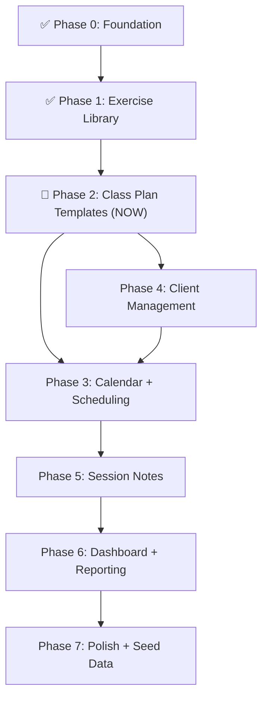

# Pilates Platform --- MVP Implementation Plan

## Current State

The repo is a monorepo with two fully functional apps:

- **Server** ([server/src/app.ts](server/src/app.ts)): Express 4 with Better Auth mounted at `/api/auth/`*, health endpoint, CORS with credentials, Prisma 7 + PostgreSQL, modular feature structure under `server/src/modules/`. Modules: `admin/` (invitation, settings, stats), `exercises/` (full CRUD + folders + progression + images + reorder), `dropdowns/` (dynamic option API), `uploads/` (temp image upload/delete). Route mounts: `/api/admin`, `/api/uploads`, `/api/exercises`, `/api/exercise-folders`, `/api/dropdowns`, plus public helpers (`/api/signup-status`, `/api/invite/verify`).
- **Client** ([client/src/app/(dashboard)/page.tsx](client/src/app/(dashboard)/page.tsx)): Next.js 16 App Router with dashboard layout, auth pages (`/login`, `/register` with **React Hook Form** + **`zodResolver`** from `@hookform/resolvers/zod` and schemas in [`client/src/lib/validation/auth-schemas.ts`](client/src/lib/validation/auth-schemas.ts)), Better Auth React client, sidebar + topbar shell with role-aware admin navigation. Full Exercise Library UI (list/grid views, create, edit, detail with Fancybox image lightbox, layers with isFinisher badge styling, dropdown-driven fields, progression chain viewer). Admin pages (users, settings). Service modules: `exercise-api`, `admin-api`, `dropdown-api`. Custom hooks: `use-debounce`, `use-dropdown-options`, `use-fancybox`, and exercise-specific hooks (`use-exercise-folders`, `use-exercise-library`, `use-exercise-list`, `use-exercise-search`). Exercise components: `exercise-form` (RHF + Zod via [`exercise-form-schema.ts`](client/src/lib/validation/exercise-form-schema.ts): `useFieldArray` for layers, `Controller` for shadcn `Select` + `BulletTextarea`, `register` for simple inputs; client rules align with server where practical — e.g. name required, movement type not `"none"`, chain type max 2), `bullet-textarea` (reusable long-text + inline `•` authoring), `exercise-pre-text` (detail page: preserves line breaks and indents lines that start with `•`), `exercise-list`, `exercise-card`, `exercise-search`, `exercise-library-header`, `exercise-folder-sidebar`, `folder-dialog`, `progression-chain-viewer`.
- **Auth**: Better Auth with cookie-based sessions, email/password, Prisma adapter, **admin plugin** (`defaultRole: "INSTRUCTOR"`, `adminRole: "ADMIN"`). `Instructor` model mapped as Better Auth's user with `Role` enum (`ADMIN`/`INSTRUCTOR`), ban fields, and invitation support. Session/Account/Verification tables managed by Better Auth.
- **Admin**: `Role` and `InvitationStatus` enums, `Invitation` and `PlatformSetting` models, `requireAdmin` middleware, signup toggle (off by default, invite-only), invitation flow with token verification and auto-accept on registration, `adminClient` plugin on frontend, `isAdmin` in auth context. Admin pages: `/admin` (dashboard), `/admin/users` (user management), `/admin/settings` (platform config).
- **Exercise Library** (Phase 1 — fully complete): Exercise CRUD with soft-delete (also cleans Cloudinary assets and `ExerciseImage` records), folder management, Cloudinary image uploads (hybrid temp flow: `POST /api/uploads/temp` with multer → promote on save via `extractImagePublicIds` middleware + two-phase compensation → `DELETE /api/uploads/temp/:publicId` → hourly `node-cron` cleanup of temp images older than 6 hours), image reordering (`PATCH /api/exercises/:id/images/reorder`), progression linking (chain viewer + `progressionNotes`/`regressionNotes` text fields), ExerciseLayer system (dynamic layers with explicit `isFinisher` boolean toggle on last layer — no automatic finisher assignment, instructors opt-in intentionally), DropdownCategory/DropdownOption system (seeded categories: exercise metadata keys **plus** `class_type` / `class_style` for upcoming class plans; instructor-scoped custom options), extended exercise fields: orientation, directionFaced, movementType, springs, machineSetup, transitionCues, cueing (all `String?`); equipment (`String[]` multiselect checkboxes + custom "Add" input; "None" clears others and **disables** all other equipment checkboxes plus custom add while selected), spinalMovement (`String[]` multiselect checkboxes; "None" clears others and **disables** all other options while selected), chainType (`String[]` multiselect checkboxes, max 2, "Both" mutual exclusivity + tooltips from `chain-type-tooltips.ts`), jointLoading (`String[]` multiselect checkboxes); progressionNotes, regressionNotes (`String?`); Fancybox lightbox for full-size image preview on detail page, react-dropzone with drag-to-sort in exercise form. **Forms**: [`exercise-form`](client/src/components/exercises/exercise-form.tsx) uses **React Hook Form** + **`zodResolver`** with [`exercise-form-schema.ts`](client/src/lib/validation/exercise-form-schema.ts) (`useFieldArray` for layers, `useWatch` for multiselects and labels, `Controller` for selects and bullet fields). **Long-text authoring**: [`bullet-textarea`](client/src/components/exercises/bullet-textarea.tsx) — **Enter** inserts `\n• `, **Shift+Enter** soft newline, **Add •** only at line start when the line does not already start with `• `; optional `label` + `toolbarEndSlot` keep label and actions on one row; **every** layer row uses bullets (not only Layer 1). **Detail display**: [`exercise-pre-text`](client/src/components/exercises/exercise-pre-text.tsx) on [`/exercises/[id]`](client/src/app/(dashboard)/exercises/[id]/page.tsx) for description, starting position, layers, cueing, notes, etc. shadcn [`Textarea`](client/src/components/ui/textarea.tsx) uses `forwardRef` for caret sync.
- **Seed**: [server/prisma/seed.ts](server/prisma/seed.ts) seeds default platform settings, promotes first user to ADMIN, and initializes **dropdown categories** with global default options: exercise-oriented keys (`orientation`, `direction_faced`, `movement_type`, `equipment`, `machine_setup`, `spinal_movement`, `chain_type`, `joint_loading`) **plus** `class_type` and `class_style` (for Phase 2 class plans). Run via `npm run seed --prefix server`.
- **Key dependencies**: Server — `express`, `better-auth`, `prisma`, `cloudinary`, `multer`, `node-cron`, `zod`, `nodemailer`. Client — `next`, `react`, `better-auth`, `react-hook-form`, `@hookform/resolvers`, `zod` (client-side form validation, aligned with server Zod 4), `react-dropzone`, `@fancyapps/ui`, `sonner`, `shadcn`, `lucide-react`.
- **Partial schema**: `ClassPlanTemplate` (id, name, instructorId, timestamps, deletedAt) and `Class` models with `ClassType`/`InstanceStatus` enums exist in schema but have **no API routes, services, or UI** yet. Relations on these models are not fully wired. `ClassPlanFolder`, `PlanSection`, `PlanSectionExercise`, `ClassInstance`, `Client`, `Enrollment`, `Attendance`, `SessionNote`, `SessionNoteExercise` models are **not yet created**.
- **Docs**: [project-scop.md](project-scop.md) defines the full MVP scope. [HYBRID_IMAGE_UPLOAD.md](HYBRID_IMAGE_UPLOAD.md) documents the image upload architecture.

---

## Schema Changes Confirmed (Client — Alexa McKay, May 2026)

The following were confirmed through client conversations and must be applied in Phase 2:

### Add `ClassPlanFolder` model

Confirmed from prototype screenshot — folders section visible on Class Plans page.

```prisma
model ClassPlanFolder {
  id           String    @id @default(cuid())
  name         String
  instructorId String
  createdAt    DateTime  @default(now())
  deletedAt    DateTime?

  instructor Instructor          @relation(fields: [instructorId], references: [id])
  templates  ClassPlanTemplate[]
}
```

### Update `ClassPlanTemplate` — add confirmed fields

Confirmed from prototype form (Class Title, Class Type, Class Style, Duration, Folder, Tags):

```prisma
classType       String?          // "reformer" | "mat" | "chair" | "cadillac" | "barrel"
classStyle      String?          // "beginner" | "intermediate" | "advanced" | "pre_post_natal"
                                 // | "hiit" | "restorative" | "jumpboard" | "classical_pilates"
durationMinutes Int?             // default 60
folderId        String?          // → ClassPlanFolder
tags            String[]         @default([])
                                 // preset tags: "Easy Teach", "Moderate", "Challenging" + custom
```

> **Note**: `rating` removed from template — rating is a post-class reflection and belongs exclusively on `ClassInstance`.

### Update `ClassInstance` — add confirmed fields

Confirmed: rating = post-class reflection (NOT MVP). isCustomised tracks edits from template.
Denormalized `classType`/`classStyle` copied from template on scheduling — enables filtering/displaying scheduled classes by equipment type on Calendar without joining back to the template.

```prisma
templateId      String?          // reference to which template was copied from
isCustomised    Boolean          @default(false)
classType       String?          // denormalized from template — "reformer" | "mat" | etc.
classStyle      String?          // denormalized from template — "beginner" | "advanced" | etc.
// NOT MVP — scaffold only, no UI:
rating          Int?
reflectionNotes String?
reviewedAt      DateTime?
```

### Add `Exercise.savedToLibrary`

Confirmed by client: exercises created inside a class plan should be saveable to library gradually.

```prisma
savedToLibrary  Boolean          @default(true)
// false = created inside a class plan, hidden from Exercise Library page
// true  = visible in Exercise Library (default for all existing exercises)
```

### Seed new DropdownCategories (confirmed from prototype screenshots May 8, 2026)

**Update (May 2026):** These keys are already seeded in [`server/prisma/seed.ts`](server/prisma/seed.ts) for dropdown infrastructure. Phase 2 should consume them in template UI rather than re-seeding from scratch.

```
classType  → Reformer, Mat, Chair, Cadillac, Barrel
classStyle → Beginner, Intermediate, Advanced, Pre/Post Natal,
             HIIT, Restorative, JumpBoard, Classical Pilates
```

---

## Key Architectural Decisions (Confirmed by Client)

- **Class Plan = Template + Instance**: `ClassPlanTemplate` (reusable, no date) → copied into `ClassInstance` (dated event). `syncWithTemplate: false` always for MVP (copy-on-use only). Editing an instance NEVER changes the original template. `isCustomised` flips `true` when instructor edits an instance.
- **Two Scheduling Flows** (both confirmed by Alexa, both accessible from Class Plans page AND Calendar):
  - **Flow 1 — Structured**: Class Plans → build template → Calendar → schedule class → attach template. Best for instructors planning ahead.
  - **Flow 2 — Quick**: Available from BOTH the Class Plans page ("Schedule this plan" button on a template) AND the Calendar (click a time slot). Creates Class + ClassInstance + copies sections in one transaction via `POST /api/quick-schedule`. Best for speed. The Class Plans page is where Alexa expects this button to live — not just the Calendar.
- **Exercise in Class Plan**: "Add Exercise" → two equal options: (1) Pick from Library — browse saved exercises; (2) Create New — full exercise form with `savedToLibrary: false` default + "Save to Library" toggle.
- **Movement Analysis** (confirmed May 11, 2026): `spinalMovement String[]` ✅ already multiselect (exercise form: "None" clears others and disables non-None checkboxes while selected). `chainType String[]` ✅ already multiselect (max 2, "Both" exclusive). `jointLoading String[]` ✅ updated to multiselect. `equipment String[]` ✅ same "None" clear + disable-siblings pattern as spinal movement in `exercise-form`. All serve to balance spinal patterns, manage joint stress, and ensure open/closed chain variety across a class.
- **ExerciseLayer `isFinisher`**: explicit boolean toggle — no automatic finisher assignment. Only the last layer shows the "Mark as finisher" checkbox. Instructors opt-in intentionally.
- **Layer and long-note bullets (May 2026)**: Bullet lists are stored as **plain text** in `String` / `ExerciseLayer.content` (literal `•` characters and newlines). No separate list model. Authoring uses **`BulletTextarea`**; read-only exercise pages use **`ExercisePreText`** for readable wrapping.
- **Client forms (May 2026)**: **`react-hook-form`** + **`zodResolver`** (`@hookform/resolvers/zod`) with **Zod 4** schemas under `client/src/lib/validation/` — login, register, and exercise create/edit. Prefer aligning client rules with server Zod (`exercise.validation.ts`, etc.) where practical.

---

## Data Model Overview

```mermaid
erDiagram
    Instructor ||--o{ Session : has
    Instructor ||--o{ Account : has
    Instructor ||--o{ Invitation : invites
    Instructor ||--o{ Class : creates
    Instructor ||--o{ ClassPlanTemplate : creates
    Instructor ||--o{ ClassPlanFolder : creates
    Instructor ||--o{ Exercise : creates
    Instructor ||--o{ Client : manages
    Instructor ||--o{ ExerciseFolder : creates
    Instructor ||--o{ DropdownOption : "custom options"

    ExerciseFolder ||--o{ Exercise : contains
    Exercise ||--o{ ExerciseImage : has
    Exercise ||--o{ ExerciseLayer : has
    Exercise ||--o| Exercise : "progression_of"

    DropdownCategory ||--o{ DropdownOption : has

    ClassPlanFolder ||--o{ ClassPlanTemplate : organises
    ClassPlanTemplate ||--o{ PlanSection : has
    PlanSection ||--o{ PlanSectionExercise : contains

    Class ||--o| ClassPlanTemplate : "uses template"
    Class ||--o{ ClassInstance : generates
    ClassInstance ||--o{ PlanSection : "has (copied)"
    ClassInstance ||--o{ Attendance : tracks
    ClassInstance ||--o{ SessionNote : has

    Client ||--o{ Attendance : attends
    Client ||--o{ SessionNote : "noted in"
    SessionNote ||--o{ SessionNoteExercise : references
```


---

## Phase 0 -- Foundation (Database, Auth, App Shell, Admin Role)

*(COMPLETED)*

Set up Prisma, PostgreSQL, Better Auth (cookie-based sessions), the shared app layout, and admin role infrastructure that every subsequent phase depends on.

### Server

- **0.1 -- Initialize Prisma and PostgreSQL connection** ✓
  - Install `prisma`, `@prisma/client`, and configure `DATABASE_URL` in [server/.env](server/.env)
  - Create `server/prisma/schema.prisma` with `Instructor` model (mapped as Better Auth user), plus `Session`, `Account`, `Verification` tables
  - Run initial migration
- **0.2 -- Set up Better Auth** ✓
  - Install `better-auth`; create `server/src/lib/auth.ts` with Prisma adapter, `emailAndPassword` enabled, `user.modelName: "Instructor"`
  - Mount `toNodeHandler(auth)` on `/api/auth/`* in `app.ts` (before `express.json()`)
  - Configure CORS with `credentials: true` and `trustedOrigins`
  - Set `BETTER_AUTH_SECRET`, `BETTER_AUTH_URL`, `CLIENT_URL` env vars
- **0.3 -- Server structure and error handling** ✓
  - Establish folder convention: `modules/<domain>/{routes,service,validation}.ts`
  - `authenticate` middleware reads session cookie via `auth.api.getSession()` and attaches `req.user` (`{ instructorId, email, role }`)
  - Global error handler middleware and custom `AppError` class
  - Request validation with `zod`
- **0.6 -- Admin role and user management infrastructure** ✓
  - `Role` enum (`ADMIN`/`INSTRUCTOR`) and `InvitationStatus` enum (`PENDING`/`ACCEPTED`/`EXPIRED`) in Prisma schema
  - Admin fields on `Instructor`: `role`, `banned`, `banReason`, `banExpires`
  - `Invitation` and `PlatformSetting` models
  - Better Auth admin plugin (`defaultRole: "INSTRUCTOR"`, `adminRole: "ADMIN"`) providing `/api/auth/admin/`* endpoints (listUsers, banUser, unbanUser, setRole, createUser)
  - `requireAdmin` middleware for custom admin routes
  - Admin module at `/api/admin/`*: invitation CRUD, platform settings (signup toggle), platform stats
  - Public endpoints: `/api/signup-status`, `/api/invite/verify`
  - Database hook to auto-accept invitations and apply role on user registration
  - Seed script (`server/prisma/seed.ts`) to bootstrap first admin and default settings

### Client

- **0.4 -- App shell and layout** ✓
  - Replace default page with app layout: sidebar navigation + top bar + main content area
  - Create reusable layout components in `client/src/components/layout/` (Sidebar, TopBar, MainContent)
  - Install and configure additional shadcn components needed across the app (Input, Card, Dialog, DropdownMenu, Table, Tabs, Badge, etc.)
- **0.5 -- Auth pages and client-side auth state** ✓
  - Install `better-auth`; create `client/src/lib/auth-client.ts` with `createAuthClient` from `better-auth/react` and `adminClient` plugin
  - Create `/login` and `/register` pages using `authClient.signIn.email()` and `authClient.signUp.email()`, wrapped with **React Hook Form** + **`zodResolver`** and shared Zod schemas in [`client/src/lib/validation/auth-schemas.ts`](client/src/lib/validation/auth-schemas.ts) (email + password validation; register includes name + min password length)
  - Register page supports signup toggle check and `?token=` invitation flow (`setValue("email", …)` when invite loads)
  - Set up `AuthProvider` context wrapping Better Auth's `useSession()` hook; expose `useAuth()` with `isAdmin` for components
  - Create a shared API client (`client/src/lib/api.ts`) with `credentials: "include"` for cookie-based auth
  - Implement protected route wrapper (`AppLayout`) that redirects unauthenticated users to `/login`
  - Role-aware sidebar with admin navigation section (Admin Dashboard, User Management, Seed Exercises, Platform Stats, Settings)
- **0.7 -- Admin pages (UI)** *(partially complete)*
  - `/admin` dashboard with key stats cards ✓
  - `/admin/users` user management table with invite, activate/deactivate, role change ✓
  - `/admin/settings` signup toggle and platform configuration ✓
  - `/admin/exercises` seed exercise library management *(deferred)*
  - `/admin/stats` dedicated reporting page *(deferred)*

---

## Phase 1 -- Exercise Library *(COMPLETED)*

The exercise library is the most self-contained domain and a dependency for class planning later.

- **1.1 -- Prisma schema: Exercise, ExerciseFolder, ExerciseImage, ExerciseLayer** ✓
  - `ExerciseFolder`: id, name, instructorId, createdAt, deletedAt
  - `Exercise`: id, name, description, startingPosition, orientation, directionFaced, movementType, springs, equipment (`String[]`, default `[]`), machineSetup, transitionCues, cueing, spinalMovement (`String[]`, default `[]`), chainType (`String[]`, default `[]`), jointLoading (`String[]`, default `[]`), tags (`String[]`, default `[]`), progressionNotes, regressionNotes, folderId, instructorId, progressionOfId (self-relation), createdAt, updatedAt, deletedAt
  - `ExerciseImage`: id, exerciseId, url, publicId, order
  - `ExerciseLayer`: id, exerciseId, order, content, isFinisher (boolean, default false), createdAt
  - Migrated
- **1.2 -- Exercise CRUD API** ✓
  - `POST/GET /api/exercises`, `GET/PATCH/DELETE /api/exercises/:id`
  - Folder endpoints: `POST/GET /api/exercise-folders`, `PATCH/DELETE /api/exercise-folders/:id`
  - Soft-delete on DELETE (set `deletedAt`, filter in queries, also removes Cloudinary assets and `ExerciseImage` records)
  - Zod validation for all inputs (including layers and extended fields)
  - `extractImagePublicIds` inline middleware moves `req.body.publicIds` to `req.imagePublicIds` before Zod validation (declaration merging in `src/types/express.d.ts`)
- **1.3 -- Image upload (Cloudinary hybrid temp flow)** ✓
  - `POST /api/uploads/temp` (multer, max 3 files, 5 MB each, JPEG/PNG/WebP) uploads to Cloudinary `temp/` folder with unique filenames
  - On exercise create/update, `publicIds[]` triggers promotion from `temp/` to `exercises/<id>/` via `attachTempImagesToExercise` service with UUID-based naming (`overwrite: false`)
  - Two-phase compensation flow: Cloudinary renames first, then Prisma transaction; rollback deletes already-moved assets on any failure
  - `DELETE /api/uploads/temp/:publicId` removes temp images from Cloudinary immediately (guarded for `temp/` prefix)
  - `PATCH /api/exercises/:id/images/reorder` reorders saved images (Zod-validated `imageIds[]`, Prisma transaction)
  - Saved images can be deleted from edit mode (removes from Cloudinary + `ExerciseImage` row)
  - Hourly `node-cron` job (`server/src/jobs/cleanup-temp-uploads.ts`) cleans temp images older than 6 hours with paginated Cloudinary API calls and batch deletion; `isCleanupRunning` manual flag prevents overlap
- **1.4 -- Exercise progression linking API** ✓
  - `PATCH /api/exercises/:id/progression` -- set `progressionOfId`
  - `GET /api/exercises/:id/progression-chain` returns `{ id, name, level }[]` from root to harder steps
  - `progressionNotes` and `regressionNotes` text fields on Exercise for free-text progression guidance
- **1.5 -- Exercise Library UI** ✓
  - `/exercises` page: grid/list view with search bar, tag filter, folder sidebar (`exercise-folder-sidebar`, `exercise-search`, `exercise-library-header`, `exercise-list`, `exercise-card`)
  - `/exercises/new` and `/exercises/[id]/edit` forms (`exercise-form`): **React Hook Form** + **`zodResolver`** ([`exercise-form-schema.ts`](client/src/lib/validation/exercise-form-schema.ts)) — `useFieldArray` for dynamic layers, `Controller` for shadcn `Select` and `BulletTextarea`, `register` / `setValue` / `getValues` / `useWatch` for the rest; image state (dropzone, reorder, temp IDs) remains outside RHF; react-dropzone (max 3, 5 MB), HTML5 drag-to-sort for both temp and saved images, remove button for both temp (API delete) and saved images
  - `/exercises/[id]` detail page with Fancybox lightbox gallery for full-size image preview (`useFancybox` hook + `@fancyapps/ui`), organized Setup / Movement Analysis / Layers / Progressions & Regressions cards; long text blocks rendered with **`exercise-pre-text`** (`whitespace-pre-wrap`-style line breaks; lines beginning with `•` get a hanging indent when wrapped)
  - `progression-chain-viewer` component (responsive, current exercise highlighted)
  - **`bullet-textarea`** ([client/src/components/exercises/bullet-textarea.tsx](client/src/components/exercises/bullet-textarea.tsx)): reusable controlled textarea — `value` + `onValueChange`; **Enter** → insert `\n• `, **Shift+Enter** → newline without new bullet; **Add •** inserts `• ` at caret only when selection is collapsed, caret is at the start of the current line, and that line does not already begin with `• `; optional **`label`** (e.g. shadcn `Label`) and **`toolbarEndSlot`** (e.g. layer remove) on the same toolbar row as **Add •** (`data-bullet-textarea-toolbar` keeps focus/blur behavior correct); **`bulletsEnabled={false}`** renders a plain shadcn `Textarea`. Wired in **`exercise-form`** (via `Controller`) for Description, Starting position, **all** dynamic layer contents, Cues / notes, progression notes, and regression notes (each layer: step title + finisher UI in `label`, remove control in `toolbarEndSlot` when more than one layer row)
  - Folder management (create, rename, delete) via `folder-dialog` in sidebar
  - Custom hooks: `use-exercise-folders`, `use-exercise-library`, `use-exercise-list`, `use-exercise-search`, `use-debounce`
  - Service module: `exercise-api` (CRUD, temp uploads, image reorder, progression chain)
- **1.6 -- Dynamic Dropdown Options** ✓
  - `DropdownCategory` and `DropdownOption` models (global + instructor-scoped)
  - `GET /api/dropdowns/:categoryKey` returns options; `POST /api/dropdowns/:categoryKey` creates instructor-scoped option
  - Seed ([`server/prisma/seed.ts`](server/prisma/seed.ts)) creates categories with keys: `orientation`, `direction_faced`, `movement_type`, `equipment`, `machine_setup`, `spinal_movement`, `chain_type`, `joint_loading`, **`class_type`**, **`class_style`** (last two feed Phase 2 template UI; counts per category match seed arrays)
  - Frontend `useDropdownOptions(key)` hook with cache; `dropdownApi` service module
- **1.7 -- Extended Exercise Fields** ✓
  - Optional metadata fields on Exercise: orientation, directionFaced, movementType, springs, machineSetup, transitionCues, cueing (all `String?`); progressionNotes, regressionNotes (`String?`)
  - Multiselect `String[]` fields with specialized UI behaviors:
    - **Equipment**: checkboxes + custom "Add" input; selecting "None" clears all others, disables every other equipment checkbox (and the custom add field/button) until "None" is unchecked — mirrors Chain Type disabled styling
    - **Spinal Movement**: checkboxes; selecting "None" clears all others and disables every other spinal-movement checkbox until "None" is unchecked
    - **Chain Type**: checkboxes; "Both" is mutually exclusive with all other options; max 2 selections; tooltips on hover (`chain-type-tooltips.ts`)
    - **Joint Loading**: simple multiselect checkboxes (Knee Loading, Wrist Loading)
  - **Springs**: free-text input with N/A quick button (not a dropdown)
  - Detail page display: Setup card (orientation, direction, movement type, springs, machine setup as single-value rows + equipment as badges), Movement Analysis card (spinal movement / chain type / joint loading as badge groups), Progressions & Regressions card (progressionNotes + regressionNotes free text)
- **1.8 -- Exercise Layer System** ✓
  - `ExerciseLayer` model: id, exerciseId, order, content, isFinisher (boolean, default false), createdAt
  - Create/update endpoints accept `layers: { content, order?, isFinisher? }[]` — service replaces atomically via `deleteMany` + `createMany`
  - Form renders dynamic layer rows (add/remove) numbered sequentially (`Layer 1`, `Layer 2`, …) via **`useFieldArray`** (`layers`); **`buildExerciseFormDefaults`** + `reset` when switching exercises by `id`
    - Only the **last** layer row shows a "Mark as finisher" checkbox
    - No automatic finisher assignment — instructors explicitly opt-in
    - Adding a new layer always appends at the end
    - Removing a layer re-evaluates which row shows the finisher checkbox
  - Detail page: layers displayed in order; `isFinisher: true` layers receive a "Finisher" badge and distinct card styling; layer body copy uses **`exercise-pre-text`** so `•` lines from the form read clearly
  - Layer step labels from `exercise-layer-labels.ts` (`getLayerStepTitle` returns "Layer N" for numbered layers)
  - **Form UX**: every appended layer row uses **`BulletTextarea`** with bullets enabled (same Enter / Shift+Enter / **Add •** behavior as Layer 1)

---

## Phase 2 -- Class Plan Templates

*(IN PROGRESS)*

Reusable plan structures with folders, sections, and exercise sequencing — confirmed architecture from client discussions.

> **Status**: `ClassPlanTemplate` model exists in schema (id, name, instructorId, timestamps, deletedAt) but has no new fields, no relations wired to sections, no folder support yet. `ClassPlanFolder`, `PlanSection`, `PlanSectionExercise` models, API routes, services, and UI are **not yet built**.

- **2.1 -- Prisma schema: ClassPlanFolder, PlanSection, PlanSectionExercise + update ClassPlanTemplate + Exercise**
  - Add `ClassPlanFolder` model (id, name, instructorId, createdAt, deletedAt)
  - Add to `ClassPlanTemplate`: classType (`String?`), classStyle (`String?`), durationMinutes (`Int?`), folderId (`String?`), tags (`String[]`, default `[]`) — no `rating` on template (rating belongs on `ClassInstance` only)
  - Add relations: `ClassPlanTemplate` → `ClassPlanFolder`, `ClassPlanTemplate` → `PlanSection[]`, `ClassPlanFolder` → `ClassPlanTemplate[]`
  - Add `ClassPlanFolder[]` back-relation to `Instructor`
  - `PlanSection`: id, name (e.g. "Warm-up"), order, templateId (`String?`), classInstanceId (`String?`), createdAt
    - Rule: exactly one of templateId or classInstanceId is always set — never both, never neither
  - `PlanSectionExercise`: id, sectionId, exerciseId, order, reps (`String?`), duration (`String?`), notes (`String?`)
    - reps/duration/notes are per-class-use metadata — not stored on Exercise itself
  - Add `savedToLibrary Boolean @default(true)` to `Exercise`
    - false = created inside a class plan, hidden from Exercise Library page
    - true = visible in library (default for all existing + library-created exercises)
  - Seed `classType` and `classStyle` DropdownCategories + options (see confirmed values above) — **note**: [`server/prisma/seed.ts`](server/prisma/seed.ts) may already define `class_type` / `class_style` keys from prior work; Phase 2 should **verify or migrate** rather than duplicate categories.
  - Run: `npx prisma migrate dev --name add_class_planning_system`
  - Run: `npx prisma generate`
- **2.2 -- Template CRUD API**
  - Follow exact same module structure as exercises: `server/src/modules/class-plans/{routes,controller,service,validation}.ts`
  - Folder endpoints:
    - `POST /api/class-plan-folders` — create folder
    - `GET /api/class-plan-folders` — list (instructorId from auth)
    - `PATCH /api/class-plan-folders/:id` — rename
    - `DELETE /api/class-plan-folders/:id` — soft-delete
  - Template endpoints:
    - `POST /api/class-plans` — create template
    - `GET /api/class-plans` — list (filter: folderId, classType, classStyle, tags, search; filter `deletedAt IS NULL`)
    - `GET /api/class-plans/:id` — get with nested sections + exercises
    - `PATCH /api/class-plans/:id` — update template
    - `DELETE /api/class-plans/:id` — soft-delete template
    - `POST /api/class-plans/:id/duplicate` — deep copy template + all sections + exercises
  - Section endpoints (nested under template):
    - `POST /api/class-plans/:id/sections` — add section
    - `PATCH /api/class-plans/:id/sections/:sectionId` — update name or order
    - `DELETE /api/class-plans/:id/sections/:sectionId` — delete section (cascades to PlanSectionExercise)
  - Exercise-in-section endpoints:
    - `POST /api/class-plans/:id/sections/:sectionId/exercises` — add exercise to section (body: exerciseId, order, reps?, duration?, notes?)
    - `PATCH /api/class-plans/:id/sections/:sectionId/exercises/:pseId` — update reps/duration/notes/order
    - `DELETE /api/class-plans/:id/sections/:sectionId/exercises/:pseId` — remove from section
  - Exercise savedToLibrary endpoint:
    - `PATCH /api/exercises/:id/save-to-library` — set `savedToLibrary: true`, optionally set folderId
  - Business rules:
    - All queries filter by `instructorId` from auth — instructors see only their own data
    - All list queries filter `deletedAt IS NULL`
    - PlanSection must have EITHER templateId OR classInstanceId — enforced in service layer
- **2.3 -- Class Planner UI (template builder)**
  - `/class-plans` listing page:
    - Folder sidebar (same pattern as `exercise-folder-sidebar`)
    - Template grid/list with search, filter by classType, classStyle, tags
    - "New Plan" button → create template modal:
      - Class Template Title (required)
      - Class Type dropdown (Reformer, Mat, Chair, Cadillac, Barrel)
      - Class Style dropdown (Beginner, Intermediate, Advanced, Pre/Post Natal, HIIT, Restorative, JumpBoard, Classical Pilates)
      - Duration mins (default 60)
      - Folder dropdown ("No Folder" default)
      - Tags (presets: Easy Teach, Moderate, Challenging + custom input)
    - Template cards show: name, classType, classStyle, duration, tags, section count, action buttons:
      - **"View / Edit"** → goes to `/class-plans/:id` planner page
      - **"Schedule"** → opens quick-schedule dialog (Flow 2 — primary entry point from Class Plans page):
        - Pre-fills template (locked)
        - Instructor picks: date, time, class type (GROUP/PRIVATE), duration
        - Submit → `POST /api/quick-schedule` → creates Class + ClassInstance + copies sections
        - On success: toast "Class scheduled!" + optional link to view on Calendar
      - **"Duplicate"** → deep copy template
      - **"Delete"** → soft-delete with confirm dialog
  - `/class-plans/:id` — template detail / planner page:
    - Template metadata header (editable inline: title, classType, classStyle, duration, tags)
    - **"Schedule this plan"** button in header → same quick-schedule dialog as above (Flow 2)
    - Section list with drag-and-drop reorder (up/down arrows as mobile fallback)
    - "Add Section" button → inline name input
    - Each section card:
      - Section name (editable inline)
      - Exercise list with drag-and-drop reorder
      - Each exercise row in the section displays:
        - **Exercise name**
        - **Movement Analysis badges** — `spinalMovement[]`, `chainType[]`, `jointLoading[]` shown as small badges beneath the name (same badge styling as exercise detail page)
          - Purpose: allows Sara to see the movement pattern of each exercise at a glance while building the plan
          - Supports balanced spinal patterns (avoid 4x Flexion in a row), joint stress management (avoid back-to-back Knee Loading), and open/closed chain variety — confirmed purpose by client (May 11, 2026)
          - Example: `[Flexion] [Open Chain]` under The Hundred, `[Extension] [Open Chain]` under Swan Dive — Sara immediately sees the balance
        - **Reps** field, **Duration** field, **Notes** field — per-class-use metadata stored on `PlanSectionExercise`, not on Exercise itself
        - **Remove** button
      - "Add Exercise" button → two-tab dialog:
        - **Tab 1: Pick from Library** — search/filter existing exercises (`savedToLibrary: true`), click to add to section
        - **Tab 2: Create New** — full `exercise-form` component (reuse existing)
          - `savedToLibrary: false` by default
          - "Save to Library" toggle at bottom → if on: show folder picker
          - On submit: creates Exercise, adds to section via PlanSectionExercise
    - "Save" button (saves all section/exercise changes)
    - "Duplicate" button (deep copy this template)
  - **API response requirement**: `GET /api/class-plans/:id` must include `spinalMovement`, `chainType`, and `jointLoading` on each exercise inside `PlanSectionExercise` for Movement Analysis badge display. No additional endpoint needed — include these fields in the nested exercise select on the existing endpoint:

```
    PlanSectionExercise {
      ...pseFields,
      exercise: {
        id, name,
        spinalMovement,   // String[] — for badges
        chainType,        // String[] — for badges
        jointLoading,     // String[] — for badges
      }
    }
    

```

---

## Phase 3 -- Calendar and Class Scheduling

*(PENDING)*

Scheduling engine for one-off and recurring classes, plus the calendar UI. Two confirmed flows from client.

> **Status**: `Class` model with `ClassType` and `InstanceStatus` enums exist in schema but relations are incomplete. `ClassInstance` model (with confirmed new fields), API routes, services, and UI are **not yet built**.

- **3.1 -- Prisma schema: ClassInstance + update Class**
  - `ClassInstance`: id, classId, date, time (`DateTime @db.Timestamptz()`), status (SCHEDULED/COMPLETED/CANCELLED), instructorId, templateId (`String?` — reference only, not live sync), isCustomised (`Boolean @default(false)`), classType (`String?` — denormalized from template), classStyle (`String?` — denormalized from template), rating (`Int?` — NOT MVP scaffold), reflectionNotes (`String?` — NOT MVP scaffold), reviewedAt (`DateTime?` — NOT MVP scaffold), createdAt, deletedAt
  - Wire all relations: `Class` → `ClassInstance[]`, `ClassInstance` → `PlanSection[]`, `ClassInstance` → `Attendance[]`, `ClassInstance` → `SessionNote[]`
  - Add `ClassInstance[]` back-relation to `Instructor`
  - Migrate
- **3.2 -- Class scheduling API**
  - `POST /api/classes` — create one-off or recurring; if recurring, auto-generate `ClassInstance` rows from recurrenceRule
  - `GET /api/classes`, `GET /api/classes/:id`
  - `PATCH /api/classes/:id` — update series
  - `PATCH /api/class-instances/:id` — update single instance; set `isCustomised: true` when plan is edited
  - `DELETE /api/classes/:id` — soft-delete series
  - `DELETE /api/class-instances/:id` — soft-delete single instance
  - `POST /api/class-instances/:id/assign-template` — copy template into instance (copy-on-use):
    1. Fetch PlanSections where templateId = given id
    2. For each: create new PlanSection with classInstanceId = instance, templateId = null
    3. For each PlanSectionExercise: create new row pointing to new section
    4. Set ClassInstance.isCustomised = false (fresh copy, not yet customised)
    5. All in single Prisma transaction
  - `POST /api/quick-schedule` — Flow 2: create + schedule in one step:
    - Body: `{ title, date, time, type, durationMinutes, templateId? }`
    - Single transaction: create Class → create ClassInstance → copy sections if templateId
- **3.3 -- Template copy-on-use logic**
  - `syncWithTemplate: false` always for MVP — copy-on-use is the only mode
  - Editing a ClassInstance's plan sections → set `isCustomised: true`
  - Original template always stays untouched
  - `templateId` on ClassInstance = audit reference only
- **3.4 -- Calendar UI**
  - `/calendar` page: weekly view (primary, per prototype) + monthly toggle
  - Calendar is a **visual overview** — instructors see what they are teaching across the week at a glance
  - Color-coded by class type (GROUP vs PRIVATE)
  - Click time slot → quick-schedule dialog (Flow 2 — secondary entry point from Calendar):
    - Instructor picks: title, type, duration, optional template
    - Submit → `POST /api/quick-schedule` (same endpoint as Class Plans "Schedule" button)
  - Click existing class instance → detail drawer (view plan, edit plan, mark complete, view enrolled clients)
  - Attach / swap plan on an existing instance: template picker inside instance detail drawer → `POST /api/class-instances/:id/assign-template`
  - `/week-overview` — simpler week list view (per prototype sidebar item)
    > **Note**: Flow 2 (quick-schedule) is available from BOTH the Class Plans page (primary — "Schedule" button on template card) AND the Calendar (secondary — click a time slot). Both call the same `POST /api/quick-schedule` endpoint. The Class Plans page is Alexa's primary entry point for quick scheduling — confirmed in client reply.
- **3.5 -- Recurring class management UI**
  - Recurrence form: day selector (Mon/Tue/Wed etc), start date, end date
  - On edit: "Just this class" vs "All future classes" choice dialog

---

## Phase 4 -- Client Management

*(PENDING)*

Client profiles, roster enrollment, and attendance tracking.

- **4.1 -- Prisma schema: Client, Enrollment, Attendance**
  - `Client`: id, firstName, lastName, email, phone, injuries, focusAreas, goals, instructorId, createdAt, updatedAt, deletedAt
  - `Enrollment`: id, clientId, classId (recurring class), enrolledAt; `@@unique([clientId, classId])`
  - `Attendance`: id, clientId, classInstanceId, present (bool); `@@unique([clientId, classInstanceId])`
  - Migrate
- **4.2 -- Client CRUD API**
  - `POST/GET /api/clients`, `GET/PATCH/DELETE /api/clients/:id`
  - Soft-delete
- **4.3 -- Enrollment and attendance API**
  - `POST/DELETE /api/classes/:id/enrollments` — add/remove clients from roster
  - `GET /api/class-instances/:id/attendance` — list enrolled clients with attendance status
  - `PATCH /api/class-instances/:id/attendance` — bulk mark attendance `[{ clientId, present: bool }]`
- **4.4 -- Client Management UI**
  - `/clients` listing page with search
  - `/clients/new` and `/clients/:id` profile page (info, injuries, goals, enrolled classes)
  - Enrollment management on class detail page (add/remove from roster)
  - Attendance checklist on class instance detail (shows enrolled clients, checkbox per client)

---

## Phase 5 -- Session Notes

*(PENDING)*

Post-class notes tied to specific class instances and individual clients.

- **5.1 -- Prisma schema: SessionNote, SessionNoteExercise**
  - `SessionNote`: id, classInstanceId (required), clientId (required), content, instructorId, createdAt, updatedAt, deletedAt
    - Both classInstanceId and clientId required — no standalone notes (enforced by schema)
  - `SessionNoteExercise`: id, sessionNoteId, exerciseId; `@@unique([sessionNoteId, exerciseId])`
  - Migrate
- **5.2 -- Session Notes API**
  - `POST /api/class-instances/:id/notes` — create note for a client in that instance
  - `GET /api/class-instances/:id/notes` — all notes for an instance
  - `GET /api/clients/:id/notes` — all notes for a client (timeline data), ordered by createdAt DESC
  - `PATCH/DELETE /api/session-notes/:id`
  - `POST /api/session-notes/:id/exercises` — attach exercises to note
  - `DELETE /api/session-notes/:id/exercises/:exerciseId` — remove exercise from note
- **5.3 -- Session Notes UI**
  - Note entry form on class instance detail page:
    - Only shows clients who marked `present: true` for that instance
    - Free text content area
    - Exercise picker (search + select from library, `savedToLibrary: true`)
  - View/edit existing notes per client per class
- **5.4 -- Client Timeline UI**
  - Chronological session history on `/clients/:id` profile page
  - Each entry: date, class name, note content, attached exercises (as badges)
  - Filter by date range

---

## Phase 6 -- Dashboard, Notifications, and Reporting

*(PENDING)*

Home dashboard and basic analytics.

- **6.1 -- Dashboard API**
  - `GET /api/dashboard/today` — today's ClassInstances with status + client count
  - `GET /api/dashboard/notifications`:
    - ClassInstances with no plan attached (warning)
    - ClassInstances COMPLETED with attended clients who have no SessionNote (nudge)
    - Upcoming classes reminder
  - `GET /api/dashboard/stats?period=week|month` — classes taught, unique clients, most-used exercises (top 5 by PlanSectionExercise count), sessions per client
- **6.2 -- Dashboard UI**
  - `/` (home page): today's upcoming classes prominently displayed, quick stats cards
  - Notification cards with action links
  - Calendar mini-view (week at a glance)
- **6.3 -- Reporting page**
  - `/reports` page with period selector (this week / this month)
  - Stat cards: classes taught, unique clients seen
  - Top exercises table (name + usage count)
  - Per-client session frequency list

---

## Phase 7 -- Polish and Seed Data

*(PENDING)*

Final quality pass and starter content.

- **7.1 -- Starter exercise library seed data**
  - Extend [server/prisma/seed.ts](server/prisma/seed.ts) with common Pilates exercises organized into equipment-based folders (Mat, Reformer, Cadillac, Chair, Barrel)
  - Include: name, description, cueing, spinalMovement[], chainType[], layers, progressionNotes
  - Mark all as `savedToLibrary: true`
- **7.2 -- Responsive design pass**
  - Audit all pages for mobile breakpoints
  - Collapsible sidebar on mobile, bottom navigation if needed
  - Touch-friendly interactions (attendance checklist, drag-and-drop arrow fallback)
- **7.3 -- Soft-delete and data integrity audit**
  - Verify all DELETE endpoints set `deletedAt` instead of hard-deleting
  - All list queries filter `deletedAt IS NULL`
  - Archived exercises still appear in historical plans and session notes
  - Archived clients still appear in historical session notes
- **7.4 -- Error states, loading states, and empty states**
  - Skeleton loaders for all data-fetching pages
  - Empty state messages per section ("No class plans yet", "No clients yet", etc.)
  - Toast notifications (sonner) for all success/error actions
  - Confirm dialogs for all destructive actions (delete, archive)
- **7.5 -- End-to-end smoke test**
  - Full flow: Register → Create exercise (with layers) → Build class plan template → Schedule recurring class → Enroll clients → Mark attendance → Write session notes → View client timeline → Check dashboard → View reports

---

## Suggested Implementation Order




Phases 3 and 4 can be built in parallel after Phase 2. Everything else is sequential.