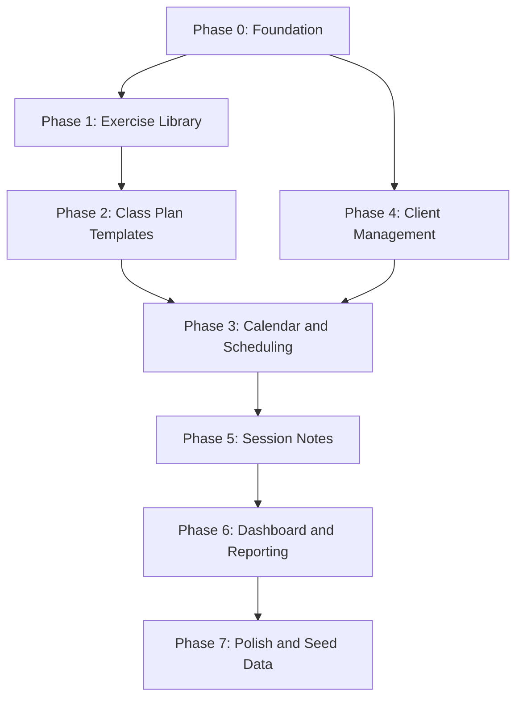

# Pilates Platform --- MVP Implementation Plan

## Current State

The repo is a monorepo with two fully functional apps:

- **Server** ([server/src/app.ts](server/src/app.ts)): Express 4 with Better Auth mounted at `/api/auth/*`, health endpoint, CORS with credentials, Prisma 7 + PostgreSQL, modular feature structure under `server/src/modules/`. Modules: `admin/` (invitation, settings, stats), `exercises/` (full CRUD + folders + progression + images + reorder), `dropdowns/` (dynamic option API), `uploads/` (temp image upload/delete). Route mounts: `/api/admin`, `/api/uploads`, `/api/exercises`, `/api/exercise-folders`, `/api/dropdowns`, plus public helpers (`/api/signup-status`, `/api/invite/verify`).
- **Client** ([client/src/app/(dashboard)/page.tsx](client/src/app/(dashboard)/page.tsx)): Next.js 16 App Router with dashboard layout, auth pages (login/register), Better Auth React client, sidebar + topbar shell with role-aware admin navigation. Full Exercise Library UI (list/grid views, create, edit, detail with Fancybox image lightbox, layers with Finisher styling, dropdown-driven fields, progression chain viewer). Admin pages (users, settings). Service modules: `exercise-api`, `admin-api`, `dropdown-api`. Custom hooks: `use-debounce`, `use-dropdown-options`, `use-fancybox`, and exercise-specific hooks (`use-exercise-folders`, `use-exercise-library`, `use-exercise-list`, `use-exercise-search`). Exercise components: `exercise-form`, `exercise-list`, `exercise-card`, `exercise-search`, `exercise-library-header`, `exercise-folder-sidebar`, `folder-dialog`, `progression-chain-viewer`.
- **Auth**: Better Auth with cookie-based sessions, email/password, Prisma adapter, **admin plugin** (`defaultRole: "INSTRUCTOR"`, `adminRole: "ADMIN"`). `Instructor` model mapped as Better Auth's user with `Role` enum (`ADMIN`/`INSTRUCTOR`), ban fields, and invitation support. Session/Account/Verification tables managed by Better Auth.
- **Admin**: `Role` and `InvitationStatus` enums, `Invitation` and `PlatformSetting` models, `requireAdmin` middleware, signup toggle (off by default, invite-only), invitation flow with token verification and auto-accept on registration, `adminClient` plugin on frontend, `isAdmin` in auth context. Admin pages: `/admin` (dashboard), `/admin/users` (user management), `/admin/settings` (platform config).
- **Exercise Library** (Phase 1 — fully complete): Exercise CRUD with soft-delete (also cleans Cloudinary assets and ExerciseImage records), folder management, Cloudinary image uploads (hybrid temp flow: `POST /api/uploads/temp` with multer → promote on save via `extractImagePublicIds` middleware + two-phase compensation → `DELETE /api/uploads/temp/:publicId` → hourly `node-cron` cleanup of temp images older than 6 hours), image reordering (`PATCH /api/exercises/:id/images/reorder`), progression linking (chain viewer + `progressionNotes`/`regressionNotes` text fields), ExerciseLayer system (dynamic layers with manual `isFinisher` toggle on last layer), DropdownCategory/DropdownOption system (8 seeded categories with instructor-scoped custom options), extended exercise fields (orientation, directionFaced, movementType, springs, equipment (`String[]` multiselect with custom entry + "None" exclusivity), machineSetup, transitionCues, cueing, spinalMovement (`String[]` multiselect with "None" exclusivity), chainType (`String[]` multiselect, max 2, "Both" mutual exclusivity + tooltips), jointLoading (`String[]` multiselect)), Fancybox lightbox for full-size image preview on detail page, react-dropzone with drag-to-sort in exercise form.
- **Seed**: [server/prisma/seed.ts](server/prisma/seed.ts) seeds default platform settings, promotes first user to ADMIN, and initializes 8 dropdown categories with updated default options (orientation 8, direction 3, equipment 7, machine setup 4, spinal movement 7, chain type 5, joint loading 3, movement type 3). Run via `npm run seed --prefix server`.
- **Key dependencies**: Server — `express`, `better-auth`, `prisma`, `cloudinary`, `multer`, `node-cron`, `zod`, `nodemailer`. Client — `next`, `react`, `better-auth`, `react-dropzone`, `@fancyapps/ui`, `sonner`, `shadcn`, `lucide-react`.
- **Partial schema**: `ClassPlanTemplate` and `Class` models with `ClassType`/`InstanceStatus` enums exist in schema but have **no API routes, services, or UI** yet. Relations on these models are not fully wired. `PlanSection`, `PlanSectionExercise`, `ClassInstance`, `Client`, `Enrollment`, `Attendance`, `SessionNote`, `SessionNoteExercise` models are **not yet created**.
- **Docs**: [project-scop.md](project-scop.md) defines the full MVP scope. [HYBRID_IMAGE_UPLOAD.md](HYBRID_IMAGE_UPLOAD.md) documents the image upload architecture.

---

## Data Model Overview

```mermaid
erDiagram
    Instructor ||--o{ Session : has
    Instructor ||--o{ Account : has
    Instructor ||--o{ Invitation : invites
    Instructor ||--o{ Class : creates
    Instructor ||--o{ ClassPlanTemplate : creates
    Instructor ||--o{ Exercise : creates
    Instructor ||--o{ Client : manages
    Instructor ||--o{ ExerciseFolder : creates
    Instructor ||--o{ DropdownOption : "custom options"

    ExerciseFolder ||--o{ Exercise : contains
    Exercise ||--o{ ExerciseImage : has
    Exercise ||--o{ ExerciseLayer : has
    Exercise ||--o| Exercise : "progression_of"

    DropdownCategory ||--o{ DropdownOption : has

    ClassPlanTemplate ||--o{ PlanSection : has
    PlanSection ||--o{ PlanSectionExercise : contains

    Class ||--o| ClassPlanTemplate : "uses template"
    Class ||--o{ ClassInstance : generates
    ClassInstance ||--o{ PlanSection : "has (copied)"
    ClassInstance ||--o{ Attendance : tracks
    ClassInstance ||--o{ SessionNote : has

    Client ||--o{ Attendance : attends
    Client ||--o{ SessionNote : "noted in"
    SessionNote ||--o{ SessionNoteExercise : references
```


---

## Phase 0 -- Foundation (Database, Auth, App Shell, Admin Role)

Set up Prisma, PostgreSQL, Better Auth (cookie-based sessions), the shared app layout, and admin role infrastructure that every subsequent phase depends on.

### Server

- **0.1 -- Initialize Prisma and PostgreSQL connection**
  - Install `prisma`, `@prisma/client`, and configure `DATABASE_URL` in [server/.env](server/.env)
  - Create `server/prisma/schema.prisma` with `Instructor` model (mapped as Better Auth user), plus `Session`, `Account`, `Verification` tables
  - Run initial migration
- **0.2 -- Set up Better Auth**
  - Install `better-auth`; create `server/src/lib/auth.ts` with Prisma adapter, `emailAndPassword` enabled, `user.modelName: "Instructor"`
  - Mount `toNodeHandler(auth)` on `/api/auth/`* in `app.ts` (before `express.json()`)
  - Configure CORS with `credentials: true` and `trustedOrigins`
  - Set `BETTER_AUTH_SECRET`, `BETTER_AUTH_URL`, `CLIENT_URL` env vars
- **0.3 -- Server structure and error handling**
  - Establish folder convention: `modules/<domain>/{routes,service,validation}.ts`
  - `authenticate` middleware reads session cookie via `auth.api.getSession()` and attaches `req.user` (`{ instructorId, email, role }`)
  - Global error handler middleware and custom `AppError` class
  - Request validation with `zod`
- **0.6 -- Admin role and user management infrastructure** *(completed)*
  - `Role` enum (`ADMIN`/`INSTRUCTOR`) and `InvitationStatus` enum (`PENDING`/`ACCEPTED`/`EXPIRED`) in Prisma schema
  - Admin fields on `Instructor`: `role`, `banned`, `banReason`, `banExpires`
  - `Invitation` and `PlatformSetting` models
  - Better Auth admin plugin (`defaultRole: "INSTRUCTOR"`, `adminRole: "ADMIN"`) providing `/api/auth/admin/`* endpoints (listUsers, banUser, unbanUser, setRole, createUser)
  - `requireAdmin` middleware for custom admin routes
  - Admin module at `/api/admin/*`: invitation CRUD, platform settings (signup toggle), platform stats
  - Public endpoints: `/api/signup-status`, `/api/invite/verify`
  - Database hook to auto-accept invitations and apply role on user registration
  - Seed script (`server/prisma/seed.ts`) to bootstrap first admin and default settings

### Client

- **0.4 -- App shell and layout**
  - Replace default page with app layout: sidebar navigation + top bar + main content area
  - Create reusable layout components in `client/src/components/layout/` (Sidebar, TopBar, MainContent)
  - Install and configure additional shadcn components needed across the app (Input, Card, Dialog, DropdownMenu, Table, Tabs, Badge, etc.)
- **0.5 -- Auth pages and client-side auth state**
  - Install `better-auth`; create `client/src/lib/auth-client.ts` with `createAuthClient` from `better-auth/react` and `adminClient` plugin
  - Create `/login` and `/register` pages using `authClient.signIn.email()` and `authClient.signUp.email()`
  - Register page supports signup toggle check and `?token=` invitation flow
  - Set up `AuthProvider` context wrapping Better Auth's `useSession()` hook; expose `useAuth()` with `isAdmin` for components
  - Create a shared API client (`client/src/lib/api.ts`) with `credentials: "include"` for cookie-based auth
  - Implement protected route wrapper (`AppLayout`) that redirects unauthenticated users to `/login`
  - Role-aware sidebar with admin navigation section (Admin Dashboard, User Management, Seed Exercises, Platform Stats, Settings)
- **0.7 -- Admin pages (UI)** *(partially complete)*
  - `/admin` dashboard with key stats cards ✓
  - `/admin/users` user management table with invite, activate/deactivate, role change ✓
  - `/admin/settings` signup toggle and platform configuration ✓
  - `/admin/exercises` seed exercise library management *(deferred)*
  - `/admin/stats` dedicated reporting page *(deferred)*

---

## Phase 1 -- Exercise Library *(COMPLETED)*

The exercise library is the most self-contained domain and a dependency for class planning later.

- **1.1 -- Prisma schema: Exercise, ExerciseFolder, ExerciseImage, ExerciseLayer ✓**
  - `ExerciseFolder`: id, name, instructorId, createdAt, deletedAt
  - `Exercise`: id, name, description, startingPosition, orientation, directionFaced, movementType, springs, equipment (`String[]`, default `[]`), machineSetup, transitionCues, cueing, spinalMovement (`String[]`, default `[]`), chainType (`String[]`, default `[]`), jointLoading (`String[]`, default `[]`), tags (`String[]`, default `[]`), progressionNotes, regressionNotes, folderId, instructorId, progressionOfId (self-relation), createdAt, updatedAt, deletedAt
  - `ExerciseImage`: id, exerciseId, url, publicId, order
  - `ExerciseLayer`: id, exerciseId, order, content, isFinisher (boolean, default false), createdAt
  - Migrated
- **1.2 -- Exercise CRUD API ✓**
  - `POST/GET /api/exercises`, `GET/PATCH/DELETE /api/exercises/:id`
  - Folder endpoints: `POST/GET /api/exercise-folders`, `PATCH/DELETE /api/exercise-folders/:id`
  - Soft-delete on DELETE (set `deletedAt`, filter in queries, also removes Cloudinary assets and `ExerciseImage` records)
  - Zod validation for all inputs (including layers and extended fields)
  - `extractImagePublicIds` inline middleware moves `req.body.publicIds` to `req.imagePublicIds` before Zod validation (declaration merging in `src/types/express.d.ts`)
- **1.3 -- Image upload (Cloudinary hybrid temp flow) ✓**
  - `POST /api/uploads/temp` (multer, max 3 files, 5 MB each, JPEG/PNG/WebP) uploads to Cloudinary `temp/` folder with unique filenames
  - On exercise create/update, `publicIds[]` triggers promotion from `temp/` to `exercises/<id>/` via `attachTempImagesToExercise` service with UUID-based naming (`overwrite: false`)
  - Two-phase compensation flow: Cloudinary renames first, then Prisma transaction; rollback deletes already-moved assets on any failure
  - `DELETE /api/uploads/temp/:publicId` removes temp images from Cloudinary immediately (guarded for `temp/` prefix)
  - `PATCH /api/exercises/:id/images/reorder` reorders saved images (Zod-validated `imageIds[]`, Prisma transaction)
  - Saved images can be deleted from edit mode (removes from Cloudinary + `ExerciseImage` row)
  - Hourly `node-cron` job (`server/src/jobs/cleanup-temp-uploads.ts`) cleans temp images older than 6 hours with paginated Cloudinary API calls and batch deletion; `isCleanupRunning` manual flag prevents overlap
- **1.4 -- Exercise progression linking API ✓**
  - `PATCH /api/exercises/:id/progression` -- set `progressionOfId`
  - `GET /api/exercises/:id/progression-chain` returns `{ id, name, level }[]` from root to harder steps
- **1.5 -- Exercise Library UI ✓**
  - `/exercises` page: grid/list view with search bar, tag filter, folder sidebar (`exercise-folder-sidebar`, `exercise-search`, `exercise-library-header`, `exercise-list`, `exercise-card`)
  - `/exercises/new` and `/exercises/[id]/edit` forms (`exercise-form`) with react-dropzone image upload (max 3, 5 MB), HTML5 drag-to-sort for both temp and saved images, remove button for both temp (API delete) and saved images
  - `/exercises/[id]` detail page with Fancybox lightbox gallery for full-size image preview (`useFancybox` hook + `@fancyapps/ui`), organized setup/movement/layer cards
  - `progression-chain-viewer` component (responsive, current exercise highlighted)
  - Folder management (create, rename, delete) via `folder-dialog` in sidebar
  - Custom hooks: `use-exercise-folders`, `use-exercise-library`, `use-exercise-list`, `use-exercise-search`, `use-debounce`
  - Service module: `exercise-api` (CRUD, temp uploads, image reorder, progression chain)
- **1.6 -- Dynamic Dropdown Options ✓**
  - `DropdownCategory` and `DropdownOption` models (global + instructor-scoped)
  - `GET /api/dropdowns/:categoryKey` returns options; `POST /api/dropdowns/:categoryKey` creates instructor-scoped option
  - 8 seeded categories: orientation, directionFaced, movementType, springs, equipment, spinalMovement, chainType, jointLoading
  - Frontend `useDropdownOptions(key)` hook with cache; `dropdownApi` service module
- **1.7 -- Extended Exercise Fields ✓**
  - Optional metadata fields on Exercise: orientation, directionFaced, movementType, springs, machineSetup, transitionCues, cueing (all `String?`); equipment, spinalMovement, chainType, jointLoading (all `String[]`, default `[]`); progressionNotes, regressionNotes (`String?`)
  - Dropdown-driven selects for single-value fields; multi-select checkboxes for array fields:
    - **Equipment**: checkboxes + custom "Add" input; "None" clears others
    - **Spinal Movement**: checkboxes; "None" clears others
    - **Chain Type**: checkboxes; "Both" mutually exclusive with others; max 2 selections; tooltips on hover (`chain-type-tooltips.ts`)
    - **Joint Loading**: simple multi-select checkboxes
  - **Springs**: text input with N/A quick button
  - Displayed on detail page: Setup card (single fields + equipment badges), Movement Analysis card (spinal movement / chain type / joint loading badges), Progressions & Regressions card (notes)
- **1.8 -- Exercise Layer System ✓**
  - `ExerciseLayer` model with ordered content blocks and explicit `isFinisher` boolean
  - Create/update endpoints accept `layers: { content, order?, isFinisher? }[]` — service replaces atomically via deleteMany + createMany
  - Form renders dynamic layer rows (add/remove) numbered sequentially (`Layer 1`, `Layer 2`, …):
    - Only the **last** layer shows a "Mark as finisher" checkbox
    - No automatic finisher assignment — instructors opt-in intentionally
    - Adding a new layer always appends at the end
  - Detail page displays layers with `isFinisher` flag; finisher-marked layers get a "Finisher" badge and distinct card styling
  - Layer labels from `exercise-layer-labels.ts` (`getLayerStepTitle` returns "Layer N" only)

---

## Phase 2 -- Class Plan Templates

Reusable plan structures that can later be attached to scheduled classes.

> **Status**: `ClassPlanTemplate` model exists in schema (id, name, instructorId, timestamps, deletedAt) but has no relations wired to sections yet. `PlanSection` and `PlanSectionExercise` models, API routes, services, and UI are **not yet built**. No `templates/` module in `server/src/modules/`, no `/templates` page in `client/src/app/(dashboard)/`.

- **2.1 -- Prisma schema: PlanSection, PlanSectionExercise** *(ClassPlanTemplate already exists)*
  - `PlanSection`: id, templateId, name (e.g. "Warm-up"), order, createdAt
  - `PlanSectionExercise`: id, sectionId, exerciseId, order, duration, reps, notes
  - Add relations on ClassPlanTemplate → PlanSection → PlanSectionExercise
  - Migrate
- **2.2 -- Template CRUD API**
  - `POST/GET /api/templates`, `GET/PATCH/DELETE /api/templates/:id`
  - Nested creation/update of sections and their exercises in a single request
  - `POST /api/templates/:id/duplicate` -- deep copy
- **2.3 -- Class Planner UI (template builder)**
  - `/templates` listing page
  - `/templates/new` and `/templates/[id]/edit` -- structured builder
  - Drag-and-drop section ordering and exercise ordering within sections
  - Exercise picker dialog (search/filter from library, insert into section)
  - Per-exercise fields in section: time, reps, notes

---

## Phase 3 -- Calendar and Class Scheduling

Scheduling engine for one-off and recurring classes, plus the calendar UI.

> **Status**: `Class` model with `ClassType` and `InstanceStatus` enums exist in schema but relations are incomplete. `ClassInstance` model, API routes, services, and UI are **not yet built**. No `classes/` module in `server/src/modules/`, no `/calendar` page in `client/src/app/(dashboard)/`.

- **3.1 -- Prisma schema: ClassInstance** *(Class model + enums already exist)*
  - `ClassInstance`: id, classId, date, time, status (SCHEDULED/COMPLETED/CANCELLED), templateSnapshotId (nullable -- copied plan), instructorId, createdAt, deletedAt
  - Add relations on Class → ClassInstance
  - Migrate
- **3.2 -- Class scheduling API**
  - `POST /api/classes` -- create one-off or recurring class; if recurring, auto-generate `ClassInstance` rows for the next N weeks
  - `GET /api/classes` and `GET /api/classes/:id`
  - `PATCH /api/classes/:id` -- update series; `PATCH /api/class-instances/:id` -- update single instance
  - `DELETE /api/classes/:id` (soft-delete series) and `DELETE /api/class-instances/:id`
- **3.3 -- Template attachment and copy-on-use logic**
  - When a template is attached to a class, deep-copy the plan into the instance by default
  - If `syncWithTemplate` is true, instance references the live template instead
  - API to swap the plan on a single instance: `PATCH /api/class-instances/:id/plan`
- **3.4 -- Calendar UI**
  - `/calendar` page with weekly and monthly views (build with a lightweight calendar library or custom grid)
  - Class creation dialog/drawer from clicking a day/time slot
  - Color-coded by class type (group vs. private)
  - Click instance to view details, edit plan, or mark complete
- **3.5 -- Recurring class management UI**
  - Recurrence form (weekly day selector, start/end date)
  - "Edit this instance" vs. "Edit all future instances" flow

---

## Phase 4 -- Client Management

Client profiles, roster enrollment, and attendance tracking.

- **4.1 -- Prisma schema: Client, Enrollment, Attendance**
  - `Client`: id, firstName, lastName, email, phone, injuries, focusAreas, goals, instructorId, createdAt, updatedAt, deletedAt
  - `Enrollment`: id, clientId, classId (recurring class), enrolledAt
  - `Attendance`: id, clientId, classInstanceId, present (bool), createdAt
  - Migrate
- **4.2 -- Client CRUD API**
  - `POST/GET /api/clients`, `GET/PATCH/DELETE /api/clients/:id`
  - Soft-delete
- **4.3 -- Enrollment and attendance API**
  - `POST/DELETE /api/classes/:id/enrollments` -- add/remove clients from roster
  - `GET /api/class-instances/:id/attendance` -- list enrolled clients with attendance status
  - `PATCH /api/class-instances/:id/attendance` -- bulk mark attendance
- **4.4 -- Client Management UI**
  - `/clients` listing page with search
  - `/clients/new` and `/clients/[id]` profile page (info, injuries, goals)
  - Enrollment management on the class detail page (add/remove from roster)
  - Attendance checklist UI on class instance detail

---

## Phase 5 -- Session Notes

Post-class notes tied to specific class instances and individual clients.

- **5.1 -- Prisma schema: SessionNote, SessionNoteExercise**
  - `SessionNote`: id, classInstanceId, clientId, content, instructorId, createdAt, updatedAt, deletedAt
  - `SessionNoteExercise`: id, sessionNoteId, exerciseId
  - Migrate
- **5.2 -- Session Notes API**
  - `POST /api/class-instances/:id/notes` -- create note for a client in that instance
  - `GET /api/class-instances/:id/notes` -- all notes for an instance
  - `GET /api/clients/:id/notes` -- all notes for a client (timeline data)
  - `PATCH/DELETE /api/session-notes/:id`
- **5.3 -- Session Notes UI**
  - Note entry form on class instance detail page (select client, write note, attach exercises)
  - Exercise picker for attaching exercises to a note
- **5.4 -- Client Timeline UI**
  - Chronological session history on `/clients/[id]` page
  - Each entry shows: date, class name, note content, attached exercises
  - Filter by date range

---

## Phase 6 -- Dashboard, Notifications, and Reporting

Home dashboard and basic analytics.

- **6.1 -- Dashboard API**
  - `GET /api/dashboard/today` -- today's classes, counts
  - `GET /api/dashboard/notifications` -- classes without plans, clients missing notes
  - `GET /api/dashboard/stats?period=week|month` -- classes taught, unique clients, most-used exercises, sessions per client
- **6.2 -- Dashboard UI**
  - `/` (home page): today's upcoming classes list, quick stats cards
  - Calendar mini-view (week at a glance)
  - Notification cards with action links
- **6.3 -- Reporting page**
  - `/reports` page with period selector (week/month)
  - Stat cards: classes taught, unique clients seen
  - Top exercises table
  - Per-client session frequency list

---

## Phase 7 -- Polish and Seed Data

Final quality pass and starter content.

- **7.1 -- Starter exercise library seed data**
  - Extend existing [server/prisma/seed.ts](server/prisma/seed.ts) (already seeds admin user + platform settings) with common Pilates exercises, organized into equipment-based folders (Mat, Reformer, Cadillac, Chair, Barrel)
  - Include progressions, descriptions, cueing
- **7.2 -- Responsive design pass**
  - Audit all pages for mobile breakpoints
  - Collapsible sidebar on mobile, bottom navigation if needed
  - Touch-friendly interactions (attendance, drag-and-drop fallback)
- **7.3 -- Soft-delete and data integrity audit**
  - Verify all DELETE endpoints set `deletedAt` instead of hard-deleting
  - Ensure all list queries filter out soft-deleted records
  - Ensure archived exercises still appear in historical plans/notes
- **7.4 -- Error states, loading states, and empty states**
  - Add skeleton loaders for all data-fetching pages
  - Empty state illustrations/messages for each section
  - Toast notifications for success/error feedback
- **7.5 -- End-to-end testing of critical flows**
  - Register -> Create exercise -> Create template -> Schedule class -> Enroll client -> Mark attendance -> Write session note -> View dashboard

---

## Suggested Implementation Order




Phases 1 and 4 can be built in parallel after Phase 0. Phase 3 depends on both. Everything else is sequential.