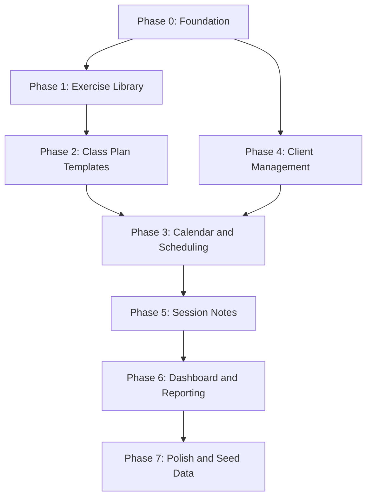

# Pilates Platform --- MVP Implementation Plan

## Current State

The repo is a monorepo with two scaffolded apps and no real feature code yet:
- **Server** ([server/src/app.ts](server/src/app.ts)): Express with Better Auth mounted at `/api/auth/*`, health endpoint, CORS with credentials, Prisma 7 + PostgreSQL, modular feature structure.
- **Client** ([client/src/app/(dashboard)/page.tsx](client/src/app/(dashboard)/page.tsx)): Next.js 16 App Router with dashboard layout, auth pages (login/register), Better Auth React client, sidebar + topbar shell.
- **Auth**: Better Auth with cookie-based sessions, email/password, Prisma adapter. `Instructor` model mapped as Better Auth's user. Session/Account/Verification tables managed by Better Auth.
- **Docs**: [project-scop.md](project-scop.md) defines the full MVP scope.

---

## Data Model Overview

```mermaid
erDiagram
    Instructor ||--o{ Session : has
    Instructor ||--o{ Account : has
    Instructor ||--o{ Class : creates
    Instructor ||--o{ ClassPlanTemplate : creates
    Instructor ||--o{ Exercise : creates
    Instructor ||--o{ Client : manages
    Instructor ||--o{ ExerciseFolder : creates

    ExerciseFolder ||--o{ Exercise : contains
    Exercise ||--o{ ExerciseImage : has
    Exercise ||--o| Exercise : "progression_of"

    ClassPlanTemplate ||--o{ PlanSection : has
    PlanSection ||--o{ PlanSectionExercise : contains

    Class ||--o| ClassPlanTemplate : "uses template"
    Class ||--o{ ClassInstance : generates
    ClassInstance ||--o{ PlanSection : "has (copied)"
    ClassInstance ||--o{ Attendance : tracks
    ClassInstance ||--o{ SessionNote : has

    Client ||--o{ Attendance : attends
    Client ||--o{ SessionNote : "noted in"
    SessionNote ||--o{ SessionNoteExercise : references
```

---

## Phase 0 -- Foundation (Database, Auth, App Shell)

Set up Prisma, PostgreSQL, Better Auth (cookie-based sessions), and the shared app layout that every subsequent phase depends on.

### Server

- **0.1 -- Initialize Prisma and PostgreSQL connection**
  - Install `prisma`, `@prisma/client`, and configure `DATABASE_URL` in [server/.env](server/.env)
  - Create `server/prisma/schema.prisma` with `Instructor` model (mapped as Better Auth user), plus `Session`, `Account`, `Verification` tables
  - Run initial migration

- **0.2 -- Set up Better Auth**
  - Install `better-auth`; create `server/src/lib/auth.ts` with Prisma adapter, `emailAndPassword` enabled, `user.modelName: "Instructor"`
  - Mount `toNodeHandler(auth)` on `/api/auth/*` in `app.ts` (before `express.json()`)
  - Configure CORS with `credentials: true` and `trustedOrigins`
  - Set `BETTER_AUTH_SECRET`, `BETTER_AUTH_URL`, `CLIENT_URL` env vars

- **0.3 -- Server structure and error handling**
  - Establish folder convention: `modules/<domain>/{routes,service,validation}.ts`
  - `authenticate` middleware reads session cookie via `auth.api.getSession()` and attaches `req.user` (`{ instructorId, email }`)
  - Global error handler middleware and custom `AppError` class
  - Request validation with `zod`

### Client

- **0.4 -- App shell and layout**
  - Replace default page with app layout: sidebar navigation + top bar + main content area
  - Create reusable layout components in `client/src/components/layout/` (Sidebar, TopBar, MainContent)
  - Install and configure additional shadcn components needed across the app (Input, Card, Dialog, DropdownMenu, Table, Tabs, Badge, etc.)

- **0.5 -- Auth pages and client-side auth state**
  - Install `better-auth`; create `client/src/lib/auth-client.ts` with `createAuthClient` from `better-auth/react`
  - Create `/login` and `/register` pages using `authClient.signIn.email()` and `authClient.signUp.email()`
  - Set up `AuthProvider` context wrapping Better Auth's `useSession()` hook; expose `useAuth()` for components
  - Create a shared API client (`client/src/lib/api.ts`) with `credentials: "include"` for cookie-based auth
  - Implement protected route wrapper (`AppLayout`) that redirects unauthenticated users to `/login`

---

## Phase 1 -- Exercise Library

The exercise library is the most self-contained domain and a dependency for class planning later.

- **1.1 -- Prisma schema: Exercise, ExerciseFolder, ExerciseImage**
  - `ExerciseFolder`: id, name, instructorId, createdAt, deletedAt
  - `Exercise`: id, name, description, cueing, tags (string[]), folderId, instructorId, progressionOfId (self-relation), createdAt, updatedAt, deletedAt
  - `ExerciseImage`: id, exerciseId, url, order (max 3)
  - Migrate

- **1.2 -- Exercise CRUD API**
  - `POST/GET /api/exercises`, `GET/PATCH/DELETE /api/exercises/:id`
  - Folder endpoints: `POST/GET /api/exercise-folders`, `PATCH/DELETE /api/exercise-folders/:id`
  - Soft-delete on DELETE (set `deletedAt`, filter in queries)
  - Zod validation for all inputs

- **1.3 -- Image upload endpoint**
  - Install Cloudinary SDK; create `server/src/lib/cloudinary.ts` helper
  - `POST /api/exercises/:id/images` (multipart, max 3 per exercise)
  - `DELETE /api/exercises/:id/images/:imageId`

- **1.4 -- Exercise progression linking API**
  - `PATCH /api/exercises/:id/progression` -- set `progressionOfId`
  - Query helper to return full progression chain (Level 1 -> 2 -> 3)

- **1.5 -- Exercise Library UI**
  - `/exercises` page: grid/list view with search bar, tag filter, folder sidebar
  - `/exercises/new` and `/exercises/[id]/edit` forms with image upload dropzone
  - Progression chain viewer component (visual Level 1 -> 2 -> 3 display)
  - Folder management (create, rename, delete) in sidebar

---

## Phase 2 -- Class Plan Templates

Reusable plan structures that can later be attached to scheduled classes.

- **2.1 -- Prisma schema: ClassPlanTemplate, PlanSection, PlanSectionExercise**
  - `ClassPlanTemplate`: id, name, instructorId, createdAt, updatedAt, deletedAt
  - `PlanSection`: id, templateId, name (e.g. "Warm-up"), order, createdAt
  - `PlanSectionExercise`: id, sectionId, exerciseId, order, duration, reps, notes
  - Migrate

- **2.2 -- Template CRUD API**
  - `POST/GET /api/templates`, `GET/PATCH/DELETE /api/templates/:id`
  - Nested creation/update of sections and their exercises in a single request
  - `POST /api/templates/:id/duplicate` -- deep copy

- **2.3 -- Class Planner UI (template builder)**
  - `/templates` listing page
  - `/templates/new` and `/templates/[id]/edit` -- structured builder
  - Drag-and-drop section ordering and exercise ordering within sections
  - Exercise picker dialog (search/filter from library, insert into section)
  - Per-exercise fields in section: time, reps, notes

---

## Phase 3 -- Calendar and Class Scheduling

Scheduling engine for one-off and recurring classes, plus the calendar UI.

- **3.1 -- Prisma schema: Class, ClassInstance**
  - `Class`: id, title, type (GROUP/PRIVATE), isRecurring, recurrenceRule (JSON), startDate, endDate, time, durationMinutes, templateId (optional), syncWithTemplate (bool), instructorId, createdAt, deletedAt
  - `ClassInstance`: id, classId, date, time, status (SCHEDULED/COMPLETED/CANCELLED), templateSnapshotId (nullable -- copied plan), instructorId, createdAt, deletedAt
  - Migrate

- **3.2 -- Class scheduling API**
  - `POST /api/classes` -- create one-off or recurring class; if recurring, auto-generate `ClassInstance` rows for the next N weeks
  - `GET /api/classes` and `GET /api/classes/:id`
  - `PATCH /api/classes/:id` -- update series; `PATCH /api/class-instances/:id` -- update single instance
  - `DELETE /api/classes/:id` (soft-delete series) and `DELETE /api/class-instances/:id`

- **3.3 -- Template attachment and copy-on-use logic**
  - When a template is attached to a class, deep-copy the plan into the instance by default
  - If `syncWithTemplate` is true, instance references the live template instead
  - API to swap the plan on a single instance: `PATCH /api/class-instances/:id/plan`

- **3.4 -- Calendar UI**
  - `/calendar` page with weekly and monthly views (build with a lightweight calendar library or custom grid)
  - Class creation dialog/drawer from clicking a day/time slot
  - Color-coded by class type (group vs. private)
  - Click instance to view details, edit plan, or mark complete

- **3.5 -- Recurring class management UI**
  - Recurrence form (weekly day selector, start/end date)
  - "Edit this instance" vs. "Edit all future instances" flow

---

## Phase 4 -- Client Management

Client profiles, roster enrollment, and attendance tracking.

- **4.1 -- Prisma schema: Client, Enrollment, Attendance**
  - `Client`: id, firstName, lastName, email, phone, injuries, focusAreas, goals, instructorId, createdAt, updatedAt, deletedAt
  - `Enrollment`: id, clientId, classId (recurring class), enrolledAt
  - `Attendance`: id, clientId, classInstanceId, present (bool), createdAt
  - Migrate

- **4.2 -- Client CRUD API**
  - `POST/GET /api/clients`, `GET/PATCH/DELETE /api/clients/:id`
  - Soft-delete

- **4.3 -- Enrollment and attendance API**
  - `POST/DELETE /api/classes/:id/enrollments` -- add/remove clients from roster
  - `GET /api/class-instances/:id/attendance` -- list enrolled clients with attendance status
  - `PATCH /api/class-instances/:id/attendance` -- bulk mark attendance

- **4.4 -- Client Management UI**
  - `/clients` listing page with search
  - `/clients/new` and `/clients/[id]` profile page (info, injuries, goals)
  - Enrollment management on the class detail page (add/remove from roster)
  - Attendance checklist UI on class instance detail

---

## Phase 5 -- Session Notes

Post-class notes tied to specific class instances and individual clients.

- **5.1 -- Prisma schema: SessionNote, SessionNoteExercise**
  - `SessionNote`: id, classInstanceId, clientId, content, instructorId, createdAt, updatedAt, deletedAt
  - `SessionNoteExercise`: id, sessionNoteId, exerciseId
  - Migrate

- **5.2 -- Session Notes API**
  - `POST /api/class-instances/:id/notes` -- create note for a client in that instance
  - `GET /api/class-instances/:id/notes` -- all notes for an instance
  - `GET /api/clients/:id/notes` -- all notes for a client (timeline data)
  - `PATCH/DELETE /api/session-notes/:id`

- **5.3 -- Session Notes UI**
  - Note entry form on class instance detail page (select client, write note, attach exercises)
  - Exercise picker for attaching exercises to a note

- **5.4 -- Client Timeline UI**
  - Chronological session history on `/clients/[id]` page
  - Each entry shows: date, class name, note content, attached exercises
  - Filter by date range

---

## Phase 6 -- Dashboard, Notifications, and Reporting

Home dashboard and basic analytics.

- **6.1 -- Dashboard API**
  - `GET /api/dashboard/today` -- today's classes, counts
  - `GET /api/dashboard/notifications` -- classes without plans, clients missing notes
  - `GET /api/dashboard/stats?period=week|month` -- classes taught, unique clients, most-used exercises, sessions per client

- **6.2 -- Dashboard UI**
  - `/` (home page): today's upcoming classes list, quick stats cards
  - Calendar mini-view (week at a glance)
  - Notification cards with action links

- **6.3 -- Reporting page**
  - `/reports` page with period selector (week/month)
  - Stat cards: classes taught, unique clients seen
  - Top exercises table
  - Per-client session frequency list

---

## Phase 7 -- Polish and Seed Data

Final quality pass and starter content.

- **7.1 -- Starter exercise library seed script**
  - Create `server/prisma/seed.ts` with common Pilates exercises, organized into equipment-based folders (Mat, Reformer, Cadillac, Chair, Barrel)
  - Include progressions, descriptions, cueing

- **7.2 -- Responsive design pass**
  - Audit all pages for mobile breakpoints
  - Collapsible sidebar on mobile, bottom navigation if needed
  - Touch-friendly interactions (attendance, drag-and-drop fallback)

- **7.3 -- Soft-delete and data integrity audit**
  - Verify all DELETE endpoints set `deletedAt` instead of hard-deleting
  - Ensure all list queries filter out soft-deleted records
  - Ensure archived exercises still appear in historical plans/notes

- **7.4 -- Error states, loading states, and empty states**
  - Add skeleton loaders for all data-fetching pages
  - Empty state illustrations/messages for each section
  - Toast notifications for success/error feedback

- **7.5 -- End-to-end testing of critical flows**
  - Register -> Create exercise -> Create template -> Schedule class -> Enroll client -> Mark attendance -> Write session note -> View dashboard

---

## Suggested Implementation Order



Phases 1 and 4 can be built in parallel after Phase 0. Phase 3 depends on both. Everything else is sequential.
