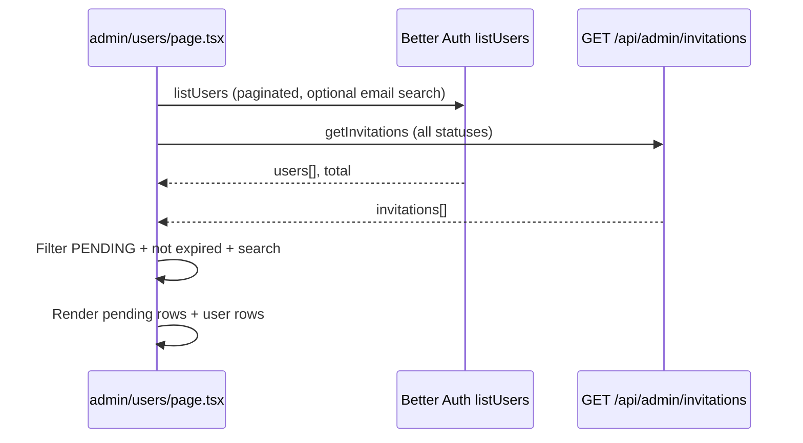
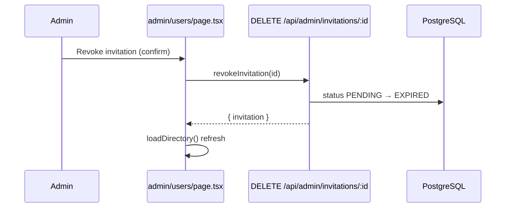

# Session Changelog — Admin User Listing: Pending Invitations

This document summarizes all work done in a single development session on the **Pilates Platform** (Layered.) for **showing pending invitations in the admin user directory**, **invitation actions**, and a **TypeScript fix** on the revoke route.

**Date context:** June 2026  
**Scope:** `client/` (Next.js 16) and `server/` (Express + Prisma)  
**Primary route:** `/admin/users`

---

## Table of contents

1. [Summary](#1-summary)
2. [User-facing functionality](#2-user-facing-functionality)
3. [End-to-end flow](#3-end-to-end-flow)
4. [Files modified](#4-files-modified)
5. [Server changes (detail)](#5-server-changes-detail)
6. [Client changes (detail)](#6-client-changes-detail)
7. [API reference](#7-api-reference)
8. [Data model notes](#8-data-model-notes)
9. [Design decisions](#9-design-decisions)
10. [Bug fix](#10-bug-fix)
11. [Testing checklist](#11-testing-checklist)
12. [Conversation timeline](#12-conversation-timeline)

---

## 1. Summary

Before this session, the **User management** page (`/admin/users`) listed only **registered instructors** via Better Auth’s `authClient.admin.listUsers`. Pending invitations existed in the database and were counted on the admin home dashboard, but they did **not** appear in the user table and had **no in-page actions**.

This session:

- Merged **pending, non-expired invitations** into the same table as registered users
- Added per-invitation actions: **View details**, **Copy invite link**, **Revoke invitation**
- Added a backend **`DELETE /api/admin/invitations/:id`** endpoint to revoke pending invites
- Refreshed the directory after invite create, revoke, ban/unban, and role change
- Fixed a TypeScript error on `req.params.id` in the new delete route

**No database migrations** were required. Revoke reuses the existing `InvitationStatus.EXPIRED` enum value.

---

## 2. User-facing functionality

### Admin user management (`/admin/users`)

| Feature | Description |
|--------|-------------|
| Pending invitation rows | Rows appear **above** registered users when status is `PENDING` and `expiresAt` is in the future |
| Visual distinction | Muted row background; name column shows *Pending* (italic); status badge **Invite pending** with mail icon |
| Search | Email search filters both registered users (server-side via Better Auth) and pending invitations (client-side, case-insensitive `includes`) |
| Header counts | Total and “showing X of Y” include registered users **plus** matching pending invitations |
| Empty states | Table shows when only pending invites exist (no registered users yet); filtered-empty only when **both** lists are empty under active search |
| Pagination | Still applies to **registered users only** (`PAGE_SIZE = 10`); pending invites are not paginated separately and always show when they match filters |

### Invitation row actions (dropdown menu)

| Action | Description |
|--------|-------------|
| View details | Opens right **Sheet** with email, role, status, expiry, created date, invited-by |
| Copy invite link | Copies `{origin}/register?token={token}` to clipboard; toast on success/failure |
| Revoke invitation | Opens confirmation **Dialog**; on confirm, marks invite `EXPIRED` and removes row from list |

### Invitation details sheet

| Field | Source |
|-------|--------|
| Email | `invitation.email` |
| Role | `invitation.role` |
| Status | Always “Pending” for visible rows |
| Expires | `invitation.expiresAt` (localized) |
| Invited | `invitation.createdAt` (localized) |
| Invited by | `invitation.invitedBy.name` + email when present |
| Inline actions | **Copy invite link**, **Revoke** buttons |

### Existing flows (unchanged behavior, improved refresh)

| Flow | Change |
|------|--------|
| Invite user dialog | After successful `POST /admin/invite`, directory reloads so new pending row appears immediately |
| Ban / unban / role change | Still use Better Auth admin plugin; now call `loadDirectory` instead of `loadUsers` |

### What invitation rows do **not** support

- No row checkbox / bulk selection (bulk deactivate remains user-only)
- No ban, role change, or activate actions (registered-user actions only)

---

## 3. End-to-end flow

### Directory load



### Revoke invitation



### Copy invite link

- Client builds URL with `buildInviteLink(token)` → `${window.location.origin}/register?token=${token}`
- Same shape as server-built link on invite create (`CLIENT_URL/register?token=...`) when app and API share the user-facing origin

---

## 4. Files modified

| File | Change type |
|------|-------------|
| `server/src/modules/admin/service.ts` | Added `revokeInvitation()` |
| `server/src/modules/admin/routes.ts` | Added `DELETE /invitations/:id`; TS cast fix |
| `client/src/services/admin-api.ts` | Added `revokeInvitation`, `buildInviteLink` |
| `client/src/components/admin/admin-user-list.tsx` | Pending invitation rows + action menu |
| `client/src/app/(dashboard)/admin/users/page.tsx` | Fetch/merge invitations, handlers, sheets, revoke dialog |

**Files not modified** (referenced but unchanged):

- `client/src/components/admin/admin-user-library-header.tsx` — still receives `totalUsers` / `visibleUserCount` from page (now includes invites)
- `server/prisma/schema.prisma` — `Invitation` model and `InvitationStatus` enum unchanged
- `client/src/components/dashboard/admin-home.tsx` — still uses `getInvitations()` for pending count card

---

## 5. Server changes (detail)

### `server/src/modules/admin/service.ts`

**New function:** `revokeInvitation(id: string)`

```typescript
export async function revokeInvitation(id: string) {
  const invitation = await prisma.invitation.findUnique({ where: { id } });
  if (!invitation) throw new NotFoundError("Invitation");
  if (invitation.status !== "PENDING") {
    throw new ConflictError("Only pending invitations can be revoked");
  }
  return prisma.invitation.update({
    where: { id },
    data: { status: "EXPIRED" as InvitationStatus },
  });
}
```

- **404** if invitation id not found (`NotFoundError`)
- **409** if status is not `PENDING` (`ConflictError`)
- Does not delete the row — sets `status` to `EXPIRED` so a new invite can be created for the same email (`createInvitation` only blocks duplicate `PENDING`)

### `server/src/modules/admin/routes.ts`

**New route:**

```typescript
router.delete("/invitations/:id", async (req: Request, res: Response) => {
  const invitation = await adminService.revokeInvitation(req.params.id as string);
  res.json({ invitation });
});
```

- Mounted under `/api/admin` with `authenticate` + `requireAdmin` (existing `app.ts` mount)
- Response: `{ invitation: InvitationRow }`

**Existing routes used unchanged:**

- `GET /api/admin/invitations` — list all invitations (all statuses)
- `POST /api/admin/invite` — create invitation + optional email

---

## 6. Client changes (detail)

### `client/src/services/admin-api.ts`

**Added:**

```typescript
revokeInvitation: (id: string) =>
  api.delete<{ invitation: InvitationRow }>(`/admin/invitations/${id}`),

export function buildInviteLink(token: string): string {
  if (typeof window !== "undefined") {
    return `${window.location.origin}/register?token=${token}`;
  }
  return `/register?token=${token}`;
}
```

### `client/src/components/admin/admin-user-list.tsx`

**New props:**

| Prop | Type | Purpose |
|------|------|---------|
| `pendingInvitations` | `InvitationRow[]` | Rows rendered before users |
| `onViewInvitationDetails` | `(invitation) => void` | Open details sheet |
| `onCopyInviteLink` | `(invitation) => void` | Copy link handler |
| `onRevokeInvitation` | `(invitation) => void` | Open revoke confirm |

**Rendering:**

- Empty state: `users.length === 0 && pendingInvitations.length === 0`
- Invitation `TableRow` key: `invite-${invitation.id}`
- Status badge: `border-primary/25 bg-primary/10 text-primary` (semantic tokens)
- Icons: `Mail`, `Copy` added to imports

### `client/src/app/(dashboard)/admin/users/page.tsx`

**Renamed loader:** `loadUsers` → `loadDirectory`

- `Promise.all([authClient.admin.listUsers(...), adminApi.getInvitations()])`
- State: `invitations: InvitationRow[]`

**Derived data (`useMemo`):**

```typescript
const pendingInvitations = invitations.filter((invitation) => {
  if (invitation.status !== "PENDING") return false;
  if (new Date(invitation.expiresAt).getTime() <= now) return false;
  if (!searchTrim) return true;
  return invitation.email.toLowerCase().includes(searchTrim.toLowerCase());
});

const directoryTotal = total + pendingInvitations.length;
const visibleCount = users.length + pendingInvitations.length;
```

**New UI state:**

- `detailsInvitation` — invitation details sheet
- `confirmRevokeInvitation` — revoke confirmation dialog

**New handlers:**

- `copyInvitationLink(invitation)` — clipboard + toast
- `runRevokeInvitation()` — `adminApi.revokeInvitation`, close sheet if same id, refresh

**Wiring to `AdminUserList`:**

```tsx
<AdminUserList
  users={users}
  pendingInvitations={pendingInvitations}
  onViewInvitationDetails={setDetailsInvitation}
  onCopyInviteLink={(invitation) => void copyInvitationLink(invitation)}
  onRevokeInvitation={setConfirmRevokeInvitation}
  onRefresh={() => loadDirectory(page)}
  // ...existing user props
/>
```

---

## 7. API reference

### `DELETE /api/admin/invitations/:id`

| | |
|--|--|
| **Auth** | Admin session cookie (`authenticate` + `requireAdmin`) |
| **Params** | `id` — invitation CUID |
| **Success** | `200` — `{ invitation: InvitationRow }` |
| **Errors** | `404` invitation not found; `409` not pending |

### `GET /api/admin/invitations` (existing)

| | |
|--|--|
| **Response** | `{ invitations: InvitationRow[] }` |
| **Note** | Returns all statuses; client filters to displayable pending rows |

### `POST /api/admin/invite` (existing)

| | |
|--|--|
| **Body** | `{ email, role: "ADMIN" \| "INSTRUCTOR" }` |
| **Response** | `{ invitation, inviteLink, emailSent?, emailError? }` |

### Better Auth `admin.listUsers` (existing)

| | |
|--|--|
| **Used for** | Paginated registered users |
| **Query** | `limit`, `offset`, optional `searchValue` / `searchField: "email"` / `searchOperator: "contains"` |

---

## 8. Data model notes

**`Invitation`** (Prisma — unchanged):

| Field | Relevance |
|-------|-----------|
| `status` | `PENDING` \| `ACCEPTED` \| `EXPIRED` |
| `expiresAt` | Client hides `PENDING` rows past expiry (DB may still say `PENDING` until verify/register path marks `EXPIRED`) |
| `token` | Used in register URL |
| `invitedBy` | Included in list API via `include: { invitedBy: { select: { name, email } } }` |

Revoke does **not** add a `CANCELLED` status — reuses `EXPIRED` for consistency with `verifyInvitation` expiry handling.

---

## 9. Design decisions

| Decision | Rationale |
|----------|-----------|
| Pending rows above users | Invites are usually few; admins see outstanding work first |
| Client-side invite search | `GET /invitations` has no search param; avoids new API surface for MVP |
| Client-side expiry filter | Matches “actionable pending” UX without server cron on list |
| Revoke → `EXPIRED` not hard delete | Preserves audit trail; aligns with `createInvitation` duplicate check on `PENDING` only |
| `buildInviteLink` uses `window.location.origin` | Works in dev/prod without extra env on client; matches user-facing register URL |
| Pagination unchanged for users | Simpler than unified server pagination across two data sources |
| Invitations excluded from bulk select | Bulk actions are ban-only today; invites need different operations |

---

## 10. Bug fix

### TypeScript: `req.params.id` on delete route

**Error:**

```
Argument of type 'string | string[]' is not assignable to parameter of type 'string'.
  Type 'string[]' is not assignable to type 'string'.
```

**Fix:** `req.params.id as string` — same pattern as `exercise.routes.ts`, `dropdown.routes.ts`, etc.

**Verified:** `npm run build --prefix server` exits `0` (`tsc` clean).

---

## 11. Testing checklist

### Pending invitations in table

- [ ] Create invite from **Invite user** dialog → row appears at top with **Invite pending** badge
- [ ] Row shows email and role badge (ADMIN vs INSTRUCTOR styling)
- [ ] With zero registered users, table still renders (not empty-state CTA only)

### Search

- [ ] Search by invited email shows matching pending row
- [ ] Search with no matches shows filtered-empty when neither users nor invites match
- [ ] Clearing search restores full pending + user lists

### Actions

- [ ] **View details** opens sheet with correct fields and invited-by
- [ ] **Copy invite link** copies working `/register?token=...` URL
- [ ] **Revoke** shows confirm dialog → row disappears after success
- [ ] Revoke from details sheet works; sheet closes when that invite is revoked

### Refresh

- [ ] After invite create, list updates without manual refresh
- [ ] After ban/unban/role change, pending rows remain visible

### API / errors

- [ ] Revoke already-revoked or accepted invite returns error toast (409)
- [ ] Non-admin cannot call `DELETE /api/admin/invitations/:id`

### Regression

- [ ] Registered user rows: view details, role change, deactivate/activate unchanged
- [ ] Bulk deactivate still works for users only
- [ ] Pagination still pages registered users only

---

## 12. Conversation timeline

1. **Request:** User listing on `/admin/users` should include **pending invitations with actions**.
2. **Implementation:**
   - Backend `revokeInvitation` + `DELETE` route
   - Client merge of invitations into `AdminUserList`
   - Page-level fetch, filter, handlers, invitation sheet, revoke dialog
   - Post-invite directory refresh
3. **Follow-up:** TypeScript error on `req.params.id` — fixed with `as string`, server build verified.
4. **Documentation:** This changelog file created.

---

## Related code paths (context)

| Area | Path |
|------|------|
| Register with token | `client/src/app/register/page.tsx` → `GET /api/invite/verify` |
| Invite acceptance on signup | `server/src/lib/auth.ts` (Better Auth hook marks `ACCEPTED`, applies role) |
| Admin home pending count | `client/src/components/dashboard/admin-home.tsx` |
| Invitation create + email | `server/src/modules/admin/routes.ts` `POST /invite`, `server/src/lib/mail.ts` |
