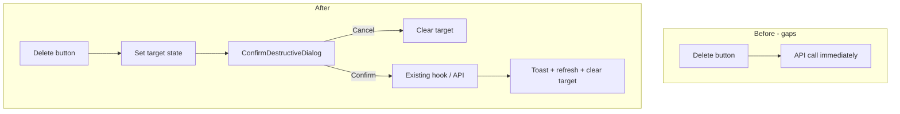

# Destructive Action Confirmation Dialogs — Changelog

This document records the work done to add **confirmation dialogs for destructive actions** across the **Pilates Platform (Layered.)** client.

**Scope:** `client/` (Next.js 16 App Router)  
**Related plan:** MVP Phase 7.4 — “Confirm dialogs for all destructive actions (delete, archive)”  
**Date context:** June 2026

---

## Table of contents

1. [Summary](#1-summary)
2. [Scope decisions](#2-scope-decisions)
3. [Approach](#3-approach)
4. [Shared component](#4-shared-component)
5. [Already confirmed (unchanged)](#5-already-confirmed-unchanged)
6. [New confirmations added](#6-new-confirmations-added)
7. [Prop / API renames](#7-prop--api-renames)
8. [Copy & UX conventions](#8-copy--ux-conventions)
9. [Out of scope](#9-out-of-scope)
10. [Files created](#10-files-created)
11. [Files modified](#11-files-modified)
12. [Verification](#12-verification)
13. [Manual test checklist](#13-manual-test-checklist)

---

## 1. Summary

| Area | What changed |
|------|----------------|
| **Shared UI** | New `ConfirmDestructiveDialog` wrapper over existing shadcn `Dialog` — consistent `rounded-3xl` styling, Cancel + destructive confirm, pending/loading labels. |
| **Exercises** | Confirm before delete (library card + detail page), delete folder, remove images in create/edit forms (temp + saved). |
| **Class plans** | Confirm before delete folder; `DeleteClassPlanDialog` refactored to use shared component. |
| **Scheduling** | Confirm cancel class, remove instance section/exercise, unenroll (single + bulk), delete session note, detach exercise from note. |
| **Clients** | Confirm unenroll from class on client edit page (archive already had confirm). |
| **Account** | Confirm remove profile photo. |
| **Backend** | No changes — confirmation is client-only; existing API/hook logic unchanged. |

**Pattern used everywhere:** **request → confirm → execute**

1. Destructive button sets a **target** in local state (entity, id list, or open flag).
2. `ConfirmDestructiveDialog` renders title/description from that target.
3. `onConfirm` calls the existing service/hook; dialog closes only after success (caller clears state).

---

## 2. Scope decisions

During planning, scope was clarified to include **all destructive actions**, not only literal delete/archive:

- **Included:** delete, archive, cancel class, unenroll, remove from plan, profile photo remove, session note delete, detach exercise from note, exercise image remove in forms.
- **Excluded:** dropdown custom option delete (API exists; no UI yet).

Existing inline confirmation dialogs (client archive, admin deactivate, template section delete, etc.) were **left as-is** — not migrated to the shared component except `DeleteClassPlanDialog`.

---

## 3. Approach

### Why not `AlertDialog`?

The project uses **Base UI `Dialog`** via `@/components/ui/dialog`. There is no shadcn `AlertDialog` in the repo. The new wrapper matches the visual language already used in `DeleteClassPlanDialog`, client archive dialogs, and admin confirm flows.

### Where logic lives

- **API calls** remain in hooks/services (`useExerciseLibrary`, `useExerciseFolders`, `schedulingApi`, `clientApi`, `sessionNoteApi`, `profileApi`, etc.).
- **Only UI** was added at call sites: state for targets + `ConfirmDestructiveDialog`.

---

## 4. Shared component

### New file: `client/src/components/ui/confirm-destructive-dialog.tsx`

**Props:**

| Prop | Type | Default | Purpose |
|------|------|---------|---------|
| `open` | `boolean` | — | Dialog visibility |
| `onOpenChange` | `(open: boolean) => void` | — | Close handler |
| `title` | `string` | — | Dialog title |
| `description` | `ReactNode` | — | Body copy (string or rich content) |
| `confirmLabel` | `string` | `"Delete"` | Primary action label |
| `confirmPendingLabel` | `string` | `{confirmLabel}…` | Label while pending |
| `cancelLabel` | `string` | `"Cancel"` | Secondary action |
| `onConfirm` | `() => void \| Promise<void>` | — | Async-friendly confirm handler |
| `pending` | `boolean` | `false` | Disables buttons, shows pending label |
| `confirmDisabled` | `boolean` | `false` | Extra disable (e.g. no target selected) |
| `confirmVariant` | `"destructive" \| "default"` | `"destructive"` | Confirm button variant |

**Styling:** `rounded-3xl border-border bg-popover p-6 shadow-xl sm:max-w-md`; outline Cancel (`rounded-full`) + confirm button.

---

## 5. Already confirmed (unchanged)

These flows already had confirmation dialogs before this work:

| Area | Location |
|------|----------|
| Archive client (list, detail, edit) | `client-list.tsx`, `clients/[id]/page.tsx`, `clients/[id]/edit/page.tsx` |
| Delete class plan | `DeleteClassPlanDialog` on `class-plans/page.tsx` |
| Delete class-plan section | `class-plan-detail-view.tsx` |
| Remove exercise from template section | `section-exercise-row.tsx` |
| Admin ban / unban / revoke invitation / role change | `admin/users/page.tsx` |
| Admin bulk deactivate | `admin-user-list.tsx` |
| Reset instance plan to template | `class-instance-drawer.tsx` |
| Regenerate recurring instances on series edit | `edit-class-dialog.tsx` |

---

## 6. New confirmations added

### Exercises

| Action | File | State / trigger |
|--------|------|-----------------|
| Delete exercise (library card) | `exercises/page.tsx` | `deleteExerciseTarget: Exercise \| null` |
| Delete exercise folder | `exercises/page.tsx` | `deleteFolderTarget: ExerciseFolder \| null` |
| Delete exercise (detail page) | `exercises/[id]/page.tsx` | `deleteOpen` |
| Remove image (single-page form) | `exercise-form.tsx` | `imageRemoveTarget: ImageItem \| null` |
| Remove image (multistep form) | `exercise-form-multistep.tsx` | `imageRemoveTarget: ImageItem \| null` |

**Copy notes:**

- Delete exercise: quotes exercise name; notes soft-delete and that it may still appear in past plans/notes.
- Delete folder: exercises stay in library; only folder label removed (matches server `folderId: null`).
- Remove image: temp uploads — “discarded”; saved images — “permanently removed from the exercise.”

### Class plans

| Action | File | State / trigger |
|--------|------|-----------------|
| Delete class-plan folder | `class-plans/page.tsx` | `deleteFolderTarget: ClassPlanFolder \| null` |

### Scheduling

| Action | File | State / trigger |
|--------|------|-----------------|
| Cancel class | `class-instance-drawer.tsx` | `cancelConfirmOpen` |
| Remove instance section | `class-instance-drawer.tsx` | `sectionRemoveTarget: PlanSectionDetail \| null` |
| Remove instance exercise | `instance-exercise-row.tsx` | `removeOpen` (per row) |
| Unenroll (single + bulk) | `enrollment-dialog.tsx` | `unenrollTarget: string[] \| null` |
| Delete session note | `session-note-card.tsx` | `deleteOpen` |
| Detach exercise from note | `session-note-card.tsx` | `detachTarget: { exerciseId, name } \| null` |

### Clients & account

| Action | File | State / trigger |
|--------|------|-----------------|
| Unenroll from class (edit page) | `clients/[id]/edit/page.tsx` | `unenrollTarget` with class title |
| Remove profile photo | `profile-photo-upload.tsx` | `removeConfirmOpen` |

---

## 7. Prop / API renames

To support the request → confirm pattern, some callback props were renamed to pass **full entities** instead of firing delete immediately:

| Component | Old prop | New prop |
|-----------|----------|----------|
| `ExerciseLibraryHeader` | `onDeleteFolder(folderId: string)` | `onRequestDeleteFolder(folder: ExerciseFolder)` |
| `ExerciseList` | `onDeleteExercise(exerciseId: string)` | `onRequestDeleteExercise(exercise: Exercise)` |
| `ExerciseCard` | `onDelete(exerciseId: string)` | `onRequestDelete(exercise: Exercise)` |
| `ClassPlanLibraryHeader` | `onDeleteFolder(folderId: string)` | `onRequestDeleteFolder(folder: ClassPlanFolder)` |

Parent pages (`exercises/page.tsx`, `class-plans/page.tsx`) own confirm dialog state and call existing hook `delete` methods on confirm.

---

## 8. Copy & UX conventions

| Action type | Confirm button label |
|-------------|----------------------|
| Client archive | Archive |
| Exercise / plan / folder / note delete | Delete |
| Section / exercise remove from plan | Remove |
| Unenroll | Remove / Unenroll |
| Cancel class | Cancel class |
| Profile photo | Remove |

**Behavior:**

- Confirm button disabled while `pending`.
- Progressive labels: `Deleting…`, `Removing…`, `Cancelling…`, etc.
- Descriptions name the entity and state what is preserved (e.g. library copy kept when removing from a section).
- Toast success/error messages unchanged in hooks/services.

---

## 9. Out of scope

- **Dropdown custom option delete** — `dropdownApi.deleteOption` exists; add confirm when UI is built.
- **Backend / soft-delete audit** — separate MVP 7.3 task.
- **Migrating all legacy inline dialogs** to `ConfirmDestructiveDialog` — only new gaps + `DeleteClassPlanDialog` refactor.

---

## 10. Files created

| File | Purpose |
|------|---------|
| `client/src/components/ui/confirm-destructive-dialog.tsx` | Reusable destructive confirmation dialog |
| `CHANGELOG_DESTRUCTIVE_ACTION_CONFIRMATIONS.md` | This document |

---

## 11. Files modified

| File | Change |
|------|--------|
| `client/src/app/(dashboard)/exercises/page.tsx` | Delete exercise + folder confirm dialogs |
| `client/src/app/(dashboard)/exercises/[id]/page.tsx` | Delete confirm on detail page |
| `client/src/app/(dashboard)/class-plans/page.tsx` | Delete folder confirm dialog |
| `client/src/app/(dashboard)/clients/[id]/edit/page.tsx` | Unenroll confirm dialog |
| `client/src/components/exercises/exercise-library-header.tsx` | `onRequestDeleteFolder` prop |
| `client/src/components/exercises/exercise-list.tsx` | `onRequestDeleteExercise` prop |
| `client/src/components/exercises/exercise-card.tsx` | `onRequestDelete` prop |
| `client/src/components/exercises/exercise-form.tsx` | Image remove confirm + fragment wrapper |
| `client/src/components/exercises/exercise-form-multistep.tsx` | Image remove confirm + fragment wrapper |
| `client/src/components/class-plans/class-plan-library-header.tsx` | `onRequestDeleteFolder` prop |
| `client/src/components/class-plans/delete-class-plan-dialog.tsx` | Refactored to compose `ConfirmDestructiveDialog` |
| `client/src/components/scheduling/class-instance-drawer.tsx` | Cancel class + remove section confirms |
| `client/src/components/scheduling/instance-exercise-row.tsx` | Remove exercise confirm (mirrors template row) |
| `client/src/components/scheduling/enrollment-dialog.tsx` | Unenroll confirm (single + bulk) |
| `client/src/components/scheduling/session-note-card.tsx` | Delete note + detach exercise confirms |
| `client/src/components/account/profile-photo-upload.tsx` | Remove photo confirm |

---

## 12. Verification

- **`npm run build --prefix client`** — passed (TypeScript + Next.js production build).
- Initial implementation used `DialogDescription asChild`, which Base UI does not support; fixed by passing `description` as direct children of `DialogDescription`.

---

## 13. Manual test checklist

Use this when validating in the browser:

- [ ] **Exercise library:** delete card → confirm → exercise removed; delete folder → exercises remain unassigned
- [ ] **Exercise detail:** Delete → confirm → redirects to library
- [ ] **Exercise create/edit:** remove temp image and saved image (edit mode) both prompt
- [ ] **Class plans:** delete folder → templates become unassigned
- [ ] **Calendar drawer:** cancel class, remove section, remove instance exercise — each prompts
- [ ] **Enrollment dialog:** single-row Remove and bulk “Remove N selected” — both prompt
- [ ] **Session notes:** delete note; detach exercise via badge X — both prompt
- [ ] **Client edit:** Unenroll from class — prompts with class title
- [ ] **Profile:** Remove photo — prompts
- [ ] **Regression:** archive client, delete class plan, admin deactivate, template section delete — still work as before

---

## Architecture diagram (before → after)

