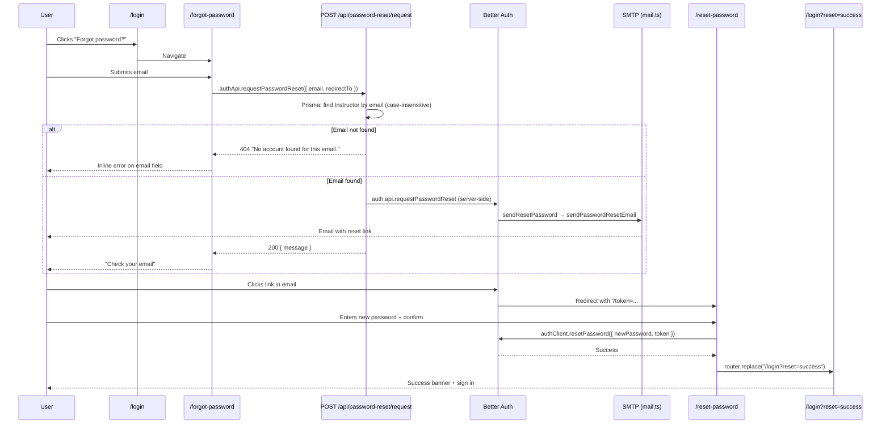

# Session Changelog — Forgot Password & Reset Password

This document summarizes all work done in a single development session on the **Pilates Platform** (Layered.) for **forgot password**, **reset password**, **rate limiting**, and **unknown-email handling**.

**Date context:** June 2026  
**Scope:** `client/` (Next.js 16) and `server/` (Express + Better Auth)

---

## Table of contents

1. [Summary](#1-summary)
2. [User-facing functionality](#2-user-facing-functionality)
3. [End-to-end flow](#3-end-to-end-flow)
4. [Files created](#4-files-created)
5. [Files modified](#5-files-modified)
6. [Server changes (detail)](#6-server-changes-detail)
7. [Client changes (detail)](#7-client-changes-detail)
8. [API reference](#8-api-reference)
9. [Rate limiting](#9-rate-limiting)
10. [Email configuration](#10-email-configuration)
11. [Security notes](#11-security-notes)
12. [Testing checklist](#12-testing-checklist)
13. [Conversation timeline](#13-conversation-timeline)

---

## 1. Summary

Before this session, the login form had no way to recover a forgotten password. We implemented a full password reset flow using **Better Auth** (`emailAndPassword.sendResetPassword`), with:

- A **Forgot password?** link on the login page
- New **`/forgot-password`** and **`/reset-password`** pages matching existing auth UI patterns
- SMTP email delivery via the existing Nodemailer setup in `mail.ts`
- **Rate limiting** on Better Auth reset endpoints (production)
- A **custom API endpoint** that returns **404** when the email is not registered (explicit error instead of Better Auth’s generic success response)
- Client-side helpers for **429 rate-limit** messages on the reset-password form

**No database migrations** were required. Rate limit storage uses in-memory mode.

---

## 2. User-facing functionality

### Login (`/login`)

| Feature | Description |
|--------|-------------|
| Forgot password link | **Forgot password?** appears to the right of the Password label; links to `/forgot-password` |
| Post-reset success banner | After a successful reset, user is redirected to `/login?reset=success` and sees: *“Your password was updated. Sign in with your new password.”* |
| Suspense wrapper | Page wrapped in `Suspense` for `useSearchParams()` (reset success query param) |

### Forgot password (`/forgot-password`)

| Feature | Description |
|--------|-------------|
| Email form | Single email field with Zod validation |
| Unknown email error | If no instructor account exists for the email → **404** → inline error on email field: *“No account found for this email.”* |
| Success state | After a valid request → “Check your email” panel with instructions (link expires in 1 hour) |
| Navigation | Links back to sign in; ghost/outline buttons styled with `buttonVariants` (no `asChild` — project `Button` does not support it) |

### Reset password (`/reset-password`)

| Feature | Description |
|--------|-------------|
| Token from email | Reads `?token=` from URL (Better Auth redirect after user clicks email link) |
| Invalid/missing token | Shows error panel when `?error=INVALID_TOKEN` or token is absent; CTA to request a new link |
| New password form | Password + confirm password (min 8 chars, must match) |
| Submit | Calls `authClient.resetPassword({ newPassword, token })` |
| Rate limit UX | 429 responses show: *“Too many attempts. Please wait a few minutes before trying again.”* via `formatAuthRequestError()` |
| Success redirect | On success → `/login?reset=success` |

---

## 3. End-to-end flow



### Better Auth email link behavior

1. Email contains a link to the **Better Auth** server: `/api/auth/reset-password/:token?callbackURL=...`
2. Better Auth validates the token and redirects to the client `redirectTo` URL:
   - Valid token → `/reset-password?token=VALID_TOKEN`
   - Invalid/expired → `/reset-password?error=INVALID_TOKEN`

Default token expiry: **1 hour** (`resetPasswordTokenExpiresIn` default in Better Auth).

---

## 4. Files created

| File | Purpose |
|------|---------|
| `client/src/app/forgot-password/page.tsx` | Forgot-password page (email form, success state, 404 handling) |
| `client/src/app/reset-password/page.tsx` | Reset-password page (token handling, new password form) |
| `client/src/lib/auth-errors.ts` | `formatAuthRequestError()` — maps 429 to user-friendly copy |
| `client/src/services/auth-api.ts` | Typed client for `POST /api/password-reset/request` |
| `server/src/modules/auth/password-reset.validation.ts` | Zod schema for custom reset request body |
| `server/src/modules/auth/password-reset.service.ts` | Lookup instructor + delegate to `auth.api.requestPasswordReset` |
| `server/src/modules/auth/password-reset.routes.ts` | Express router: `POST /request` |

---

## 5. Files modified

| File | Changes |
|------|---------|
| `client/src/app/login/page.tsx` | Forgot password link; `Suspense` + success banner for `?reset=success`; split into `LoginPage` / `LoginPageContent` |
| `client/src/components/auth/auth-page-shell.tsx` | `AuthField` gains optional `labelEnd?: ReactNode` for label-row actions (e.g. forgot link) |
| `client/src/lib/validation/auth-schemas.ts` | Added `forgotPasswordFormSchema`, `resetPasswordFormSchema` (+ inferred types) |
| `server/src/lib/auth.ts` | `sendResetPassword` handler; `rateLimit` config with password-reset custom rules |
| `server/src/lib/mail.ts` | `sendPasswordResetEmail()` + types `SendPasswordResetEmailInput` / `SendPasswordResetEmailResult` |
| `server/src/app.ts` | Mount `app.use("/api/password-reset", passwordResetRoutes)` (public, after `express.json()`) |

### Files intentionally unchanged

| File | Note |
|------|------|
| `client/src/lib/auth-client.ts` | Still used by reset-password page for `authClient.resetPassword()` |
| `client/src/context/auth-context.tsx` | No changes; login/register unchanged |
| `server/prisma/schema.prisma` | No new models |

---

## 6. Server changes (detail)

### `server/src/lib/auth.ts`

**`emailAndPassword.sendResetPassword`**

- Calls `sendPasswordResetEmail({ to: user.email, resetLink: url })`
- If SMTP not configured: logs reset URL to console (dev fallback)
- If SMTP configured but send fails: logs error

**`rateLimit`** (see [§9 Rate limiting](#9-rate-limiting))

### `server/src/lib/mail.ts`

**`sendPasswordResetEmail(input)`**

- Subject: `Reset your Layered. password`
- Plain text + HTML body with reset link
- Reuses existing `isMailConfigured()`, `createTransport()`, same env vars as invite emails
- Returns `{ ok: true }` or `{ ok: false, message }`

### `server/src/modules/auth/` (new module)

**`password-reset.validation.ts`**

```ts
{
  email: string;      // trim, required, valid email
  redirectTo?: string; // optional valid URL
}
```

**`password-reset.service.ts`**

1. `prisma.instructor.findFirst` with `email` **case-insensitive**
2. If not found → `throw new AppError("No account found for this email.", 404)`
3. If found → `auth.api.requestPasswordReset({ body, headers: fromNodeHeaders(headers) })`
4. Returns `{ message: "Password reset email sent." }`

**`password-reset.routes.ts`**

- `POST /request` — validated, public (no `authenticate` middleware)

### `server/src/app.ts`

```ts
app.use("/api/password-reset", passwordResetRoutes);
```

Mounted after `express.json()` alongside other public routes (`/api/signup-status`, `/api/invite/verify`).

---

## 7. Client changes (detail)

### `client/src/lib/validation/auth-schemas.ts`

| Schema | Fields |
|--------|--------|
| `forgotPasswordFormSchema` | `email` — trim, required, valid email |
| `resetPasswordFormSchema` | `password` (min 8), `confirmPassword`; `.refine()` passwords match |

### `client/src/components/auth/auth-page-shell.tsx`

- `AuthFieldProps.labelEnd?: ReactNode` — renders in the label row (right side), takes precedence over `hint` when provided
- Used on login page for the forgot-password link without duplicating field markup

### `client/src/lib/auth-errors.ts`

```ts
formatAuthRequestError(error, fallback)
```

- `error.status === 429` → rate limit message
- Otherwise → `error.message` or `fallback`
- Used on **reset-password** page (Better Auth client errors)

### `client/src/services/auth-api.ts`

```ts
authApi.requestPasswordReset({ email, redirectTo? })
  → POST /api/password-reset/request
```

Forgot-password page uses this instead of `authClient.requestPasswordReset()` so the server can return **404** for unknown emails.

### UI patterns

- All auth pages use `AuthPageShell`, `AuthFormCard`, `AuthField`, `AuthFormAlert`, `AuthFooterLink`
- Forms: React Hook Form + `zodResolver`
- Primary actions: `Button` with `rounded-full`
- Link-styled buttons: `Link` + `buttonVariants()` (not `Button asChild`)

---

## 8. API reference

### Custom endpoint (app-owned)

**`POST /api/password-reset/request`** — public

**Request body**

```json
{
  "email": "instructor@example.com",
  "redirectTo": "http://localhost:3000/reset-password"
}
```

**Responses**

| Status | Body | When |
|--------|------|------|
| `200` | `{ "message": "Password reset email sent." }` | Instructor found; reset email triggered |
| `404` | `{ "error": "No account found for this email." }` | No matching `Instructor` |
| `400` | `{ "error": "Validation failed", "details": [...] }` | Invalid body (Zod) |
| `500` | `{ "error": "Internal server error" }` | Unhandled error |

### Better Auth endpoints (used internally / by reset page)

| Endpoint | Used by | Purpose |
|----------|---------|---------|
| `POST /api/auth/request-password-reset` | Server service (after email check) | Create token + send email |
| `GET /api/auth/reset-password/:token` | Email link click | Validate token → redirect to client with `?token=` or `?error=INVALID_TOKEN` |
| `POST /api/auth/reset-password` | `authClient.resetPassword()` on reset page | Set new password with token |

---

## 9. Rate limiting

Configured in `server/src/lib/auth.ts` under `rateLimit`:

| Setting | Value |
|---------|--------|
| `enabled` | `process.env.NODE_ENV === "production"` |
| Default window | 60 seconds |
| Default max | 100 requests per window |
| `storage` | `"memory"` |

**Custom rules (stricter for password reset)**

| Path | Window | Max |
|------|--------|-----|
| `/request-password-reset` | 15 minutes (900s) | 3 |
| `/reset-password` (POST) | 15 minutes | 5 |
| `/reset-password/*` (GET callback) | 60 seconds | 30 |

**Notes**

- Better Auth disables rate limiting in **development** by default unless `enabled: true`
- Server-side `auth.api.*` calls are **not** rate-limited by Better Auth
- The custom `POST /api/password-reset/request` endpoint is **not** separately rate-limited (only the internal Better Auth call runs server-side)
- Client reset page handles **429** via `formatAuthRequestError()`

To test rate limits locally: set `rateLimit.enabled: true` in `auth.ts` or run with `NODE_ENV=production`.

---

## 10. Email configuration

Password reset emails use the **same SMTP env vars** as admin invitations:

| Variable | Required | Description |
|----------|----------|-------------|
| `SMTP_HOST` | Yes | SMTP server host |
| `SMTP_PORT` | Yes | SMTP port |
| `SMTP_USER` | Yes | SMTP username |
| `SMTP_PASS` | Yes | SMTP password |
| `MAIL_FROM` | Yes | From address |
| `SMTP_SECURE` | No | `"true"` for TLS |
| `CLIENT_URL` | Recommended | Trusted origin for Better Auth + CORS |
| `BETTER_AUTH_URL` | Recommended | Better Auth base URL (reset links in email) |

**Development without SMTP:** reset still works — the server logs the full reset URL to the console:

```
[auth] Password reset email not sent (SMTP not configured). Reset link for user@example.com: <url>
```

---

## 11. Security notes

### Unknown email disclosure

Better Auth’s default `requestPasswordReset` always returns success to prevent **email enumeration**. This session added an explicit **404** when the email is not found, per product request.

**Trade-off:** attackers can probe which emails have accounts. Documented here for awareness.

### Token expiry

Reset links expire in **1 hour** (Better Auth default `resetPasswordTokenExpiresIn`).

### Origin check

Better Auth `requestPasswordReset` uses `originCheck` on `redirectTo` — `redirectTo` must be a trusted origin (`CLIENT_URL` in `trustedOrigins`).

### Case-insensitive email lookup

Custom endpoint uses Prisma `mode: "insensitive"` for instructor lookup.

---

## 12. Testing checklist

- [ ] Login page shows **Forgot password?** link next to Password label
- [ ] `/forgot-password` — submit unregistered email → inline error *“No account found for this email.”*
- [ ] `/forgot-password` — submit registered email → success panel (with SMTP: receive email; without SMTP: check server console for link)
- [ ] Email link opens `/reset-password?token=...`
- [ ] Expired/invalid link → error state with link to `/forgot-password`
- [ ] Reset form — password &lt; 8 chars → validation error
- [ ] Reset form — mismatched confirm → *“Passwords do not match”*
- [ ] Successful reset → redirect to `/login?reset=success` with green success banner
- [ ] Sign in with new password works
- [ ] (Production) Repeated reset requests hit rate limit → friendly 429 message on reset page

---

## 13. Conversation timeline

| Step | Request | What was done |
|------|---------|----------------|
| 1 | Forgot password missing on login form | Full flow: login link, `/forgot-password`, `/reset-password`, Better Auth `sendResetPassword`, `sendPasswordResetEmail`, Zod schemas, `AuthField.labelEnd`, post-reset login banner |
| 2 | Add rate limit for reset password | `rateLimit` in `auth.ts` with custom rules; `auth-errors.ts` + 429 handling on reset page |
| 3 | If user not found, show error | Custom `POST /api/password-reset/request` module; forgot page uses `authApi`; 404 on email field; success copy no longer says “if account exists” |
| 4 | Create MD file with all details | This document |

---

## Quick file tree (this session)

```
pilates-platform/
├── CHANGELOG_FORGOT_PASSWORD.md          ← this file
├── client/src/
│   ├── app/
│   │   ├── forgot-password/page.tsx      ← NEW
│   │   ├── reset-password/page.tsx       ← NEW
│   │   └── login/page.tsx                ← MODIFIED
│   ├── components/auth/
│   │   └── auth-page-shell.tsx           ← MODIFIED (labelEnd)
│   ├── lib/
│   │   ├── auth-errors.ts                ← NEW
│   │   └── validation/auth-schemas.ts    ← MODIFIED
│   └── services/
│       └── auth-api.ts                   ← NEW
└── server/src/
    ├── app.ts                            ← MODIFIED
    ├── lib/
    │   ├── auth.ts                       ← MODIFIED
    │   └── mail.ts                       ← MODIFIED
    └── modules/auth/
        ├── password-reset.routes.ts      ← NEW
        ├── password-reset.service.ts     ← NEW
        └── password-reset.validation.ts  ← NEW
```
