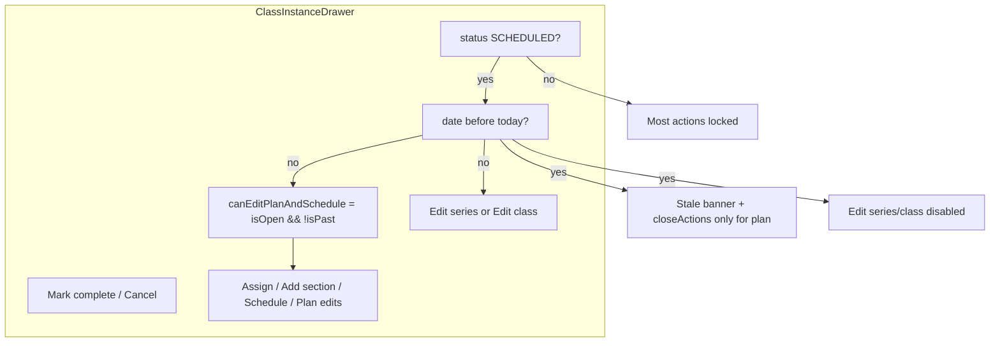

# Class Instance Drawer — Session Updates

Technical documentation for work completed in the Cursor session covering **instance lifecycle rules**, **private 1:1 enrollment UX**, **single-class editing**, and **dashboard notifications for stale sessions**.

---

## 1. Overview

### Goals

1. Enforce consistent **business rules** on calendar **Class Instance Drawer** actions based on instance status and date.
2. Guide instructors when a session is **past its scheduled date** but still `SCHEDULED` (forgot to close).
3. Expose **Edit class…** for one-off (non-recurring) classes, separate from **Edit series…**.
4. Align **private session enrollment** with **1:1** UX (single client, not multi-select roster).
5. Surface **past open sessions** on the instructor dashboard as actionable notifications.

### Scope

- **Frontend-only** for drawer rules and enrollment UX (no Prisma schema changes).
- **One backend addition**: `needsClosure` query in dashboard notifications API.
- **No new API routes**; existing `PATCH` endpoints unchanged.

---

## 2. Instance status model

| Status | Meaning |
|--------|---------|
| `SCHEDULED` | Active occurrence — planning, teaching, or not yet closed |
| `COMPLETED` | Session happened and is closed |
| `CANCELLED` | Session will not run |

Enrollment is at **Class** level; attendance and session notes are at **ClassInstance** level (PRIVATE only in drawer).

---

## 3. Derived state (`class-instance-drawer.tsx`)

Three booleans drive UI gating:

```typescript
const isOpen = detail?.status === "SCHEDULED";
const isPast = detail ? isBeforeToday(new Date(detail.date)) : false;
const canEditPlanAndSchedule = isOpen && !isPast;
```

| Flag | Definition |
|------|------------|
| `isOpen` | Instance is still `SCHEDULED` |
| `isPast` | Instance calendar `date` is strictly before today (local), via `isBeforeToday` from `@/lib/calendar-utils` |
| `canEditPlanAndSchedule` | Future or **today** scheduled sessions only — not past open sessions |

**Note:** `isPast` is **date-only**, not time-of-day. A class scheduled later today remains editable until midnight local time.

---

## 4. Session actions — disabled rules

| Button / control | Enabled when |
|------------------|--------------|
| **Mark complete** | `status === "SCHEDULED"` |
| **Cancel class** | `status === "SCHEDULED"` |
| **Assign / swap template** | `canEditPlanAndSchedule` |
| **Add section** | `canEditPlanAndSchedule` |
| **Reset to template** | `canEditPlanAndSchedule && detail.isCustomised && detail.templateId` |
| **Edit series…** (recurring) | `!isPast` (metadata/series edit blocked on past instances) |
| **Edit class…** (one-off) | `!isPast` |
| **Date & time** pickers + Save schedule | `canEditPlanAndSchedule` |
| **Plan inline edits** (sections, exercises) | `canEditPlanAndSchedule` |

### Past + still `SCHEDULED` (stale session)

When `isOpen && isPast`, an **amber warning banner** appears above session actions:

- **Title:** “This session is past its scheduled date”
- **Body:** “Mark it complete if it happened, or cancel if it did not.”

Only **Mark complete** and **Cancel class** remain actionable for plan/schedule; **attendance** and **session notes** (PRIVATE) stay available for closure workflow.

### Closed instances (`COMPLETED` / `CANCELLED`)

- Plan and schedule editing disabled (`!isOpen`).
- Mark complete and Cancel disabled.
- Edit class (one-off, same-day completed) can remain enabled when `!isPast` for title/duration fixes.

---

## 5. Edit class vs Edit series

### Problem

`EditClassDialog` was mounted in the drawer but only reachable via **Edit series…**, which showed only for `detail.class.isRecurring`. One-off classes had no entry point.

### Solution

| Class type | Button | Dialog `mode` |
|------------|--------|----------------|
| Recurring | Edit series… | `"series"` |
| One-off | Edit class… | `"single"` |

### `EditClassDialog` — `mode` prop

**File:** `client/src/components/scheduling/edit-class-dialog.tsx`

```typescript
export type EditClassDialogMode = "series" | "single";
```

| `mode` | Title | Fields shown | Submit payload |
|--------|-------|--------------|----------------|
| `"series"` | Edit class series | Full form: title, type, duration, recurring, dates, time, weekdays | `updateClass` with recurrence + optional regeneration |
| `"single"` | Edit class | Title, type, duration only | `updateClass` with `{ title, type, durationMinutes }` only |

**Why hide date/time in single mode?** The drawer **Date and time** panel updates the **instance** via `updateClassInstance`. Updating `Class.time` / `startDate` alone does not sync the calendar instance for one-offs. Schedule changes stay in one place.

**Success toasts:** `"Class updated"` (single) vs `"Class series updated"` (series).

---

## 6. Instructor workflows — missed sessions & no-shows

Documented product rules (no separate DB status for “no-show” or “instructor missed”):

### Instructor missed / class did not run

1. Open past instance on calendar.
2. **Cancel class** → `CANCELLED`.

### Client no-show (PRIVATE)

1. Open instance → attendance checklist.
2. Leave client **unchecked** (`present: false`).
3. **Save attendance** → **Mark complete**.

Session notes require `present: true` on the API; absent clients do not appear on client timeline.

### Forgot to close (past + `SCHEDULED`)

- Dashboard **needsClosure** notification (see §8).
- Drawer banner prompts Mark complete or Cancel.
- Cannot reschedule to a past date (`minDate={todayYmd()}` on date picker).

---

## 7. Private 1:1 enrollment UX

### Problem

`EnrollmentDialog` was built for **group** roster management (multi-select, bulk add/remove). It was only used from `AttendanceChecklist`, which renders for **PRIVATE** classes only — mismatch with 1:1 sessions.

### Solution

**`EnrollmentDialog`** — new `mode` prop:

```typescript
export type EnrollmentDialogMode = "private" | "group";
// default: "private"
```

#### Private mode (drawer)

- **Title:** “Assign client” / “Change client”
- **Description:** One client per private class.
- **Current client** card with Remove when enrolled.
- **Radio list** to pick a client (same pattern as template attach dialog).
- **Assign / Change client** replaces existing enrollment (unenroll all → enroll selected).
- No multi-select, no “select all”, no bulk actions.

#### Group mode

- Original multi-checkbox UI preserved for potential future use (not shown in instance drawer).

### `AttendanceChecklist` copy updates

| Before | After |
|--------|-------|
| Clients (N enrolled) | **Client** + assigned name subtitle |
| Manage enrollment | **Assign client** / **Change client** |
| Add clients | **Assign client** |
| No clients enrolled… | No client assigned to this private session yet. |

Passes `mode="private"` to `EnrollmentDialog`.

---

## 8. Dashboard — `needsClosure` notifications

### Problem

Past `SCHEDULED` instances (never marked complete/cancelled) were invisible on the home dashboard.

### API

**Endpoint:** `GET /api/dashboard/notifications`  
**File:** `server/src/modules/dashboard/dashboard.service.ts`

New parallel query `needsClosureRows`:

```typescript
where: {
  instructorId,
  deletedAt: null,
  status: "SCHEDULED",
  date: { lt: today },  // UTC calendar date
  class: { deletedAt: null },
}
orderBy: [{ date: "desc" }, { time: "desc" }],
take: 20,
```

Response shape (extended):

```typescript
interface DashboardNotificationsResponse {
  noPlan: DashboardNotificationItem[];       // future SCHEDULED, no template/sections
  needsClosure: DashboardNotificationItem[]; // past SCHEDULED
  missingNotes: DashboardNotificationItem[];
  upcoming: DashboardNotificationItem[];
}
```

**File:** `client/src/lib/types.ts`

### UI

**File:** `client/src/components/dashboard/instructor-home.tsx`

- New **`NeedsClosureNotificationsGroup`** — expandable amber panel (same pattern as `NoPlanNotificationsGroup`).
- Rendered **above** no-plan warnings in Notifications section.
- Each row links to `calendarInstanceHref(instanceId)` → `/calendar?instance=…`
- Copy: “Past sessions still open — mark complete if they happened, or cancel if they did not.”

### Distinction: `noPlan` vs `needsClosure`

| Notification | Filter |
|--------------|--------|
| `noPlan` | `SCHEDULED`, `date >= today`, no `templateId`, no sections |
| `needsClosure` | `SCHEDULED`, `date < today` (any plan state) |

A past open session always appears in `needsClosure`; future sessions without plans appear in `noPlan`.

---

## 9. Files changed

| File | Changes |
|------|---------|
| `client/src/components/scheduling/class-instance-drawer.tsx` | `isOpen`, `isPast`, `canEditPlanAndSchedule`; stale banner; button/panel/plan gating; Edit class button; `EditClassDialog` mode prop |
| `client/src/components/scheduling/edit-class-dialog.tsx` | `mode: "series" \| "single"`; conditional copy, fields, `submitSingleUpdate` |
| `client/src/components/scheduling/enrollment-dialog.tsx` | `mode: "private" \| "group"`; 1:1 radio UI; client swap on assign |
| `client/src/components/scheduling/attendance-checklist.tsx` | 1:1 copy; `mode="private"` |
| `client/src/components/dashboard/instructor-home.tsx` | `NeedsClosureNotificationsGroup`; notifications total/copy |
| `client/src/lib/types.ts` | `needsClosure` on `DashboardNotificationsResponse` |
| `server/src/modules/dashboard/dashboard.service.ts` | `needsClosure` query + response field |

---

## 10. What was NOT changed

- No Prisma migrations or new models.
- No new `InstanceStatus` values (no `NO_SHOW`, etc.).
- No server-side enforcement of PRIVATE max-one enrollment (client UX only).
- No server-side gating on plan edits by instance status (UI-only).
- GROUP enrollment UI still hidden from instance drawer (PRIVATE-only attendance block).
- `syncWithTemplate` / copy-on-use template rules unchanged.

---

## 11. Manual test checklist

### Instance drawer — future `SCHEDULED`

- [ ] All plan/schedule actions enabled.
- [ ] Mark complete and Cancel enabled.
- [ ] Recurring: **Edit series…** enabled. One-off: **Edit class…** enabled.

### Instance drawer — past `SCHEDULED`

- [ ] Amber stale-session banner visible.
- [ ] Only Mark complete + Cancel enabled for plan/schedule actions.
- [ ] Assign, Add section, Reset, date/time, inline plan edits disabled.
- [ ] Edit series / Edit class disabled.
- [ ] PRIVATE: attendance + notes still work.

### Instance drawer — `COMPLETED` / `CANCELLED`

- [ ] Plan/schedule locked.
- [ ] Mark complete / Cancel disabled.
- [ ] Edit class enabled on same-day completed (non-past) one-off.

### Edit class (single mode)

- [ ] One-off: dialog shows title, type, duration only.
- [ ] Save updates class metadata; drawer title/duration refresh.
- [ ] Date/time changes only via drawer schedule panel.

### Private enrollment

- [ ] Empty: “Assign client” opens radio picker.
- [ ] One client assigned; “Change client” swaps enrollment.
- [ ] Cannot multi-select enroll.

### Dashboard

- [ ] Past `SCHEDULED` instances appear under **past sessions still open**.
- [ ] Expandable list links open correct instance in calendar drawer.
- [ ] Future no-plan sessions still appear under **classes need a plan**.

---

## 12. Architecture diagram



---

## 13. Related existing behavior

- **Attendance:** `showAttendance` when `SCHEDULED` or `COMPLETED`; read-only roster list when `CANCELLED`.
- **Session notes:** API requires client `present: true` (`session-note.service.ts`).
- **Reschedule recurring:** Edit scope dialog — “this session” vs “all future”; regeneration deletes future `SCHEDULED` instances from anchor.
- **Reschedule validation:** Cannot set date before today (client + server `updateClassInstanceSchema`).

---

*Session updates: instance drawer business rules, private enrollment 1:1, edit-class single mode, past-session dashboard notifications.*
