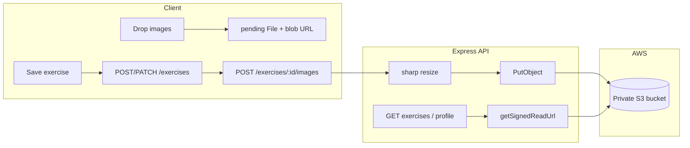

# Cloudinary → Private S3 Migration

Complete record of planning, implementation, and AWS setup for the Pilates Platform image storage migration (conversation summary).

---

## 1. Why we migrated

**Before (Cloudinary + temp flow):**

```
Drop image → POST /api/uploads/temp → Cloudinary temp/
Save exercise → publicIds[] in body → promote temp/ → exercises/{id}/
Abandon form → hourly cron deletes stale temp/ images
```

**After (S3 private bucket + upload on save):**

```
Drop image → blob preview in browser (File held locally)
Save exercise → POST/PATCH /api/exercises (JSON only)
Then → POST /api/exercises/:id/images per pending file → S3
Read APIs → presigned URLs signed from S3 keys in DB
```

### Decisions made in planning

| Topic | Decision |
|-------|----------|
| Storage | Private S3 bucket (not public URLs in DB) |
| Temp uploads | **Removed** — no `temp/` prefix, no promote step, no cleanup cron |
| Exercise images | Client-side **pending** files until save |
| Read access | **Presigned GET URLs** generated on API responses |
| Image resize | **sharp** on server (800×800 exercise, 400×400 avatar WebP) |
| Video (future) | Same storage module; videos use presigned **multipart** direct-to-S3 (not implemented yet) |

---

## 2. Architecture



### S3 object key layout

| Asset | Key pattern |
|-------|-------------|
| Exercise image | `exercises/{exerciseId}/{uuid}.webp` |
| Profile avatar | `avatars/{instructorId}/profile.webp` |

### Database semantics

| Field | Stores |
|-------|--------|
| `ExerciseImage.publicId` | S3 object key (source of truth) |
| `ExerciseImage.url` | Same key at write time; API overwrites with signed URL on read |
| `Instructor.avatarUrl` | S3 key; session may hold key; client resolves via `GET /api/profile/avatar` |

---

## 3. What was removed

| Removed | Reason |
|---------|--------|
| `POST/DELETE /api/uploads/temp` | No staging uploads |
| `promoteImage` / `attachTempImagesToExercise` | No temp → permanent promotion |
| `cleanup-temp-uploads` cron | No orphaned temp objects |
| `extractImagePublicIds` middleware | No `publicIds` on create/update body |
| `req.imagePublicIds` (Express augmentation) | Same |
| `cloudinary` npm package | Replaced by AWS SDK + sharp |
| `node-cron` | Only used for temp cleanup |
| `HYBRID_IMAGE_UPLOAD.md` | Replaced by `S3_IMAGE_STORAGE.md` |

---

## 4. Server implementation

### New dependencies (`server/package.json`)

- `@aws-sdk/client-s3`
- `@aws-sdk/s3-request-presigner`
- `sharp`

### New files

| File | Purpose |
|------|---------|
| `server/src/lib/storage.ts` | S3 client, upload, delete, presigned read URLs |
| `server/src/lib/image-processing.ts` | sharp resize helpers |
| `server/src/lib/media-urls.ts` | Sign exercise images + avatars on API responses |
| `server/scripts/migrate-cloudinary-to-s3.ts` | One-time Cloudinary → S3 data migration |

### Modified server files

| File | Changes |
|------|---------|
| `server/src/modules/exercises/exercise.routes.ts` | S3 upload on `POST /:id/images`; sign URLs on all read/write image responses; removed temp `publicIds` flow |
| `server/src/modules/exercises/exercise.service.ts` | `addImage` stores S3 key; `deleteExercise` deletes S3 objects; removed `attachTempImagesToExercise` |
| `server/src/modules/profile/profile.service.ts` | Avatar upload/delete via S3; returns `{ url, storageKey }` |
| `server/src/modules/profile/profile.routes.ts` | Added `GET /avatar` for signed URL when session holds storage key |
| `server/src/app.ts` | Removed `/api/uploads` mount |
| `server/src/index.ts` | Removed temp cleanup cron startup |

### API endpoints (image-related)

| Method | Path | Description |
|--------|------|-------------|
| `POST` | `/api/exercises/:id/images` | Multipart `image` → resize → S3 → DB row |
| `DELETE` | `/api/exercises/:id/images/:imageId` | Delete DB row + S3 object |
| `PATCH` | `/api/exercises/:id/images/reorder` | Reorder saved images |
| `POST` | `/api/profile/avatar` | Upload avatar |
| `GET` | `/api/profile/avatar` | Signed read URL for current user |
| `DELETE` | `/api/profile/avatar` | Remove avatar |

Exercise list/detail/create/update responses sign `images[].url` from `publicId`.

---

## 5. Client implementation

### Exercise forms (`exercise-form.tsx`, `exercise-form-multistep.tsx`)

**Image item type:**

```ts
type ImageItem =
  | { type: "saved"; data: ExerciseImage }
  | { type: "pending"; file: File; previewUrl: string };
```

**Flow:**

1. `onDrop` — append pending items with `URL.createObjectURL(file)` (no server call).
2. `removeImage` — pending: revoke blob URL locally; saved: `deleteImage` API on edit.
3. `onSubmit` — save exercise JSON → upload each pending file via `exerciseApi.addImage` → reorder if mixed saved/pending order.

### New / updated client files

| File | Purpose |
|------|---------|
| `client/src/lib/exercise-form-images.ts` | Shared `ImageItem` helpers, blob URL cleanup |
| `client/src/hooks/use-signed-avatar-url.ts` | Resolve S3 storage keys to presigned URLs |
| `client/src/services/profile-api.ts` | `getAvatar`, `uploadAvatar` returns `storageKey` |
| `client/src/services/exercise-api.ts` | Removed `uploadTempImages`, `deleteTempImage`, `publicIds` |
| `client/src/lib/utils.ts` | `avatarDisplayUrl` skips extra query params on presigned URLs |
| `client/next.config.ts` | S3 `remotePatterns` (+ legacy Cloudinary during migration) |

### Avatar handling

- Upload stores **storage key** in DB via API; `syncSessionImage(storageKey)` keeps Better Auth session consistent.
- `AccountAvatar` uses `useSignedAvatarUrl` to fetch presigned URL when session image is a key (not `http://`).

---

## 6. Environment variables

### Server (`server/.env`)

```env
AWS_REGION=us-east-1
AWS_S3_BUCKET=your-bucket-name
AWS_ACCESS_KEY_ID=AKIA...
AWS_SECRET_ACCESS_KEY=...
S3_SIGNED_URL_TTL_SECONDS=3600
```

- `S3_SIGNED_URL_TTL_SECONDS` is app-defined (e.g. `3600` = 1 hour). Not from AWS.

### Client (`client/.env`, optional for `next/image`)

```env
NEXT_PUBLIC_S3_BUCKET=your-bucket-name
NEXT_PUBLIC_AWS_REGION=us-east-1
```

---

## 7. AWS setup guide (step by step)

### Step 1 — Create S3 bucket

1. AWS Console → **S3** → **Create bucket**
2. Choose a **globally unique** name (e.g. `pilates-platform-media-yourname`)
3. Pick a **region** (e.g. `us-east-1`) → use same value for `AWS_REGION`
4. **Block all public access** → ON (required for private bucket)
5. Create bucket

### Step 2 — Create IAM group + custom policy

1. **IAM** → **User groups** → **Create group**
2. Group name e.g. `pilates-platform-s3-access`
3. **Create policy** (opens new tab) → **JSON** → paste:

```json
{
  "Version": "2012-10-17",
  "Statement": [
    {
      "Sid": "S3ObjectReadWriteDelete",
      "Effect": "Allow",
      "Action": [
        "s3:PutObject",
        "s3:GetObject",
        "s3:DeleteObject"
      ],
      "Resource": "arn:aws:s3:::YOUR-BUCKET-NAME/*"
    },
    {
      "Sid": "S3ListBucket",
      "Effect": "Allow",
      "Action": "s3:ListBucket",
      "Resource": "arn:aws:s3:::YOUR-BUCKET-NAME"
    }
  ]
}
```

**Replace `YOUR-BUCKET-NAME`** with your real bucket name in **both** `Resource` lines.

**What `/*` means:** It is **not** part of the bucket name. In IAM ARNs:

- `arn:aws:s3:::my-bucket` = the bucket itself (used for `ListBucket`)
- `arn:aws:s3:::my-bucket/*` = all **objects/files** inside the bucket (used for Put/Get/Delete)

4. Name policy e.g. `PilatesPlatformS3BucketPolicy` → create
5. Attach policy to group → **Create group**

### Step 3 — Create IAM user

1. **IAM** → **Users** → **Create user**
2. Name e.g. `pilates-platform-app`
3. **Do not** enable console access (programmatic only)
4. Add user to group `pilates-platform-s3-access`
5. Create user

### Step 4 — Create access key

1. User → **Security credentials** → **Access keys** → **Create access key**
2. Use case: **Application running outside AWS**
3. AWS may recommend **IAM Roles Anywhere** — that is for enterprise/temporary credentials. For **local dev**, access keys are fine; acknowledge and continue.
4. **Description tag** (optional but recommended):

   ```text
   Pilates Platform local dev server — S3 private bucket image uploads
   ```

5. Copy **Access key ID** and **Secret access key** (secret shown once) into `server/.env`

### Production note

When deploying on AWS (EC2, ECS, Lambda), prefer an **IAM role** attached to the service instead of long-lived access keys in `.env`.

---

## 8. Migrate existing Cloudinary data

If the database still has Cloudinary URLs or `publicId` values:

```bash
cd server
npm run migrate:s3
```

Or:

```bash
npx tsx scripts/migrate-cloudinary-to-s3.ts
```

The script:

1. Loads all `ExerciseImage` rows and instructors with `avatarUrl`
2. Downloads from stored URL (or builds Cloudinary URL from `publicId` if `CLOUDINARY_CLOUD_NAME` is set)
3. Resizes and uploads to S3
4. Updates DB with S3 keys

---

## 9. How to test

1. Fill in `server/.env` with real AWS values
2. Restart dev server: `npm run dev` (from repo root)
3. **Profile:** Account settings → upload/remove avatar
4. **Exercise:** Create or edit exercise → drop images → save → verify images on detail page and library card
5. **S3 console:** Confirm objects under `exercises/` and `avatars/` prefixes

### Common errors

| Symptom | Likely cause |
|---------|----------------|
| `AWS_S3_BUCKET is not configured` | Missing or empty `AWS_S3_BUCKET` in `.env` |
| Access Denied | Wrong bucket name in IAM policy vs `.env`, or user not in group |
| Broken image URLs | Region mismatch; or presigned URL expired (refresh page) |
| Avatar not showing | Session holds storage key — `GET /api/profile/avatar` should return signed URL |

---

## 10. Future video support

Not implemented in this migration, but the design supports it:

| Media | Upload path |
|-------|-------------|
| Images | Multer → Express → sharp → S3 (current) |
| Video (later) | Presigned multipart upload browser → S3 directly; `POST .../media/upload-session` + `complete` |

Suggested future DB model: `ExerciseMedia` with `type` (IMAGE/VIDEO), `status` (PENDING/READY), `storageKey`, `posterKey`, `durationSec`.

Storage keys could be:

- `exercises/{id}/images/{uuid}.webp`
- `exercises/{id}/videos/{uuid}/source.mp4`

Same `getSignedReadUrl` works for video objects (or HLS via CloudFront later).

---

## 11. Related documentation

| File | Contents |
|------|----------|
| `S3_IMAGE_STORAGE.md` | Shorter technical reference for the new storage layer |
| `.cursor/rules/project.mdc` | Updated project conventions (S3, pending uploads) |
| `server/scripts/migrate-cloudinary-to-s3.ts` | Migration script source |

---

## 12. Security checklist

- [ ] Never commit `server/.env` or access keys to git
- [ ] S3 bucket has **Block all public access** enabled
- [ ] IAM policy scoped to **one bucket** only (not `AmazonS3FullAccess`)
- [ ] Use IAM **group** for permissions; user inherits from group
- [ ] Rotate access keys if exposed
- [ ] On AWS production deploy, switch to IAM **role** instead of access keys

---

*Document created from implementation work and AWS setup Q&A in the Cloudinary → S3 migration session.*
