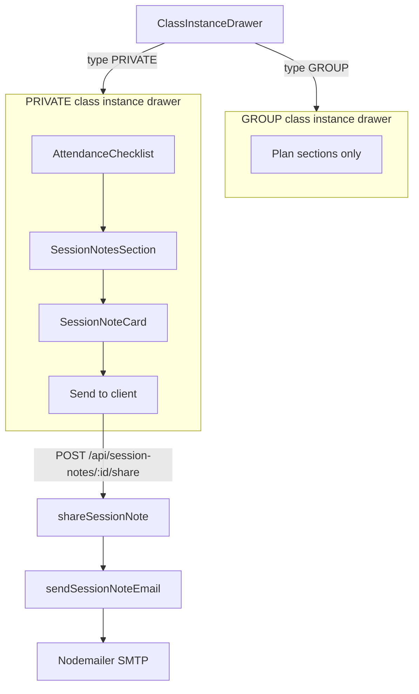
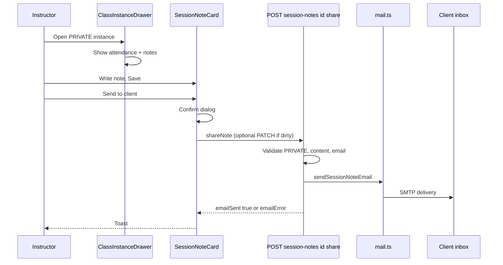

# Client Notes: Private-Only Scope + Email Sharing

Technical and functional documentation for work completed in the conversation aligning the platform with Alexa’s client-notes requirements (June 2026).

---

## Background & product intent

### Client feedback (Alexa)

1. **Client Notes are for 1:1 (private) sessions** — instructors running private training need per-client progress tracking (session notes, injuries/goals, exercises over time). Clients should **not** appear when planning or running **group** classes.
2. **Email sharing** — after a private session, instructors should be able to **send session notes to the client’s email** so the client stays informed about what was covered.

### What already existed before this work

The codebase already had a full client + session-notes stack usable for both GROUP and PRIVATE:

| Layer | Capability |
|-------|------------|
| **Data** | `Client`, `Enrollment`, `Attendance`, `SessionNote`, `SessionNoteExercise` (Prisma) |
| **API** | Client CRUD, attendance per instance, session notes CRUD + exercise attach, client timeline |
| **UI** | `/clients` roster + profile + timeline; calendar **ClassInstanceDrawer** with attendance checklist + session notes for **all** class types |

### Decision taken (no removal, scope instead)

- **Keep** client roster, session notes, and per-client tracking — they match Alexa’s 1:1 vision.
- **Do not** add a platform toggle for MVP — hard-scope UI to `PRIVATE` only.
- **Add** email share from the session note card in the drawer (not from client management alone).

---

## Summary of changes

| Area | Change |
|------|--------|
| **Class instance drawer** | Attendance + session notes hidden when `detail.class.type === "GROUP"` |
| **Email** | New `sendSessionNoteEmail` + `POST /api/session-notes/:id/share` |
| **Attendance API** | Rows now include `email` for share confirmation UI |
| **Session note API** | `client` include adds `email`; new `shareNote` client helper |
| **Session note card** | “Send to client” button + confirm dialog; saves unsaved text before send |

**Unchanged:** `/clients` pages, enrollment flows, backend note creation rules for private instances, group class scheduling/plan UI.

---

## Architecture





---

## Functionality (user-facing)

### Private sessions only (drawer)

- Opening a **GROUP** class from calendar/week overview: drawer shows schedule, plan, reflection, etc. — **no** “Clients” attendance block, **no** “Session notes” section.
- Opening a **PRIVATE** class: unchanged workflow — mark attendance, write per-client notes, attach exercises.

### Email share

1. Instructor saves a session note with non-empty content.
2. **Send to client** appears (mail icon) when the note exists and content is non-empty.
3. Confirmation dialog shows the client email (from roster / attendance row).
4. On confirm:
   - If the textarea differs from the saved note, **PATCH** runs first.
   - **POST** share endpoint sends email.
5. Success toast: `Session notes sent to {email}`.
6. Failure: toast with `emailError` or API validation message (e.g. SMTP not configured, empty content, non-private class).

### Email content

- **Subject:** `Your session summary — {classTitle} ({sessionDate})`
- **Body:** greeting with client first name, instructor name, session date/time, note text (line breaks preserved), optional bullet list of exercises on the note.
- **Footer:** “— Layered.”
- **Requires:** same SMTP env as admin invites (`SMTP_HOST`, `SMTP_PORT`, `SMTP_USER`, `SMTP_PASS`, `MAIL_FROM`, optional `SMTP_SECURE`).

### Server-side guards (share)

- Note must belong to authenticated instructor.
- Parent class must be `type === "PRIVATE"`.
- Note `content` must be non-empty after trim.
- Client must have a non-empty `email` on file.

---

## API reference

### New endpoint

| Method | Path | Auth | Body | Response |
|--------|------|------|------|----------|
| `POST` | `/api/session-notes/:id/share` | `authenticate` | — | `{ emailSent: boolean, emailError?: string }` |

Mounted on existing router at `/api/session-notes` in `server/src/app.ts`.

**Errors (via global handler):**

- `404` — note not found / not owned
- `400` — `ValidationError`: empty content, missing client email, or class not PRIVATE

### Modified response shape

**`GET` / `PATCH` `/api/class-instances/:id/attendance`** — each row now includes:

```ts
{
  clientId: string;
  firstName: string;
  lastName: string;
  email: string;      // added
  present: boolean | null;
}
```

**Session note JSON** (`client` relation on list/get/create/update):

```ts
client: {
  id: string;
  firstName: string;
  lastName: string;
  email: string;      // added to select
}
```

### Existing endpoints (unchanged paths)

Session notes still created via:

- `POST /api/class-instances/:id/notes` — upsert note (still requires client present on instance per existing rules)
- `GET /api/class-instances/:id/notes` — list notes for instance
- `PATCH /api/session-notes/:id` — update content
- Client timeline: `GET /api/clients/:id/notes`

---

## Backend implementation details

### `server/src/lib/mail.ts`

**New exports:**

- `SendSessionNoteEmailInput` — `to`, `clientFirstName`, `instructorName`, `classTitle`, `sessionDate`, `content`, `exercises[]`
- `SendSessionNoteEmailResult` — `{ ok: true }` | `{ ok: false; message }`
- `sendSessionNoteEmail(input)` — mirrors invite pattern: checks `isMailConfigured()`, builds `text` + `html` (HTML-escaped), uses `createTransport()`, never throws on SMTP failure

**Helpers (private):** `escapeHtml`, `contentToHtmlParagraphs`

### `server/src/modules/session-notes/session-note.service.ts`

**`shareSessionNote(noteId, instructorId)`:**

1. Load note with `client` (incl. email), `exercises.exercise.name`, `classInstance` (date, time, `class.title`, `class.type`).
2. Validate PRIVATE, content, client email.
3. Load `Instructor.name` for greeting (fallback: `"Your instructor"`).
4. Format session label via `formatSessionDateLabel` (UTC locale string).
5. Call `sendSessionNoteEmail`.
6. Return `{ emailSent: false, emailError }` or `{ emailSent: true }`.

**`noteInclude`:** `client.select` extended with `email: true`.

### `server/src/modules/session-notes/session-note.routes.ts`

- `router.post("/:id/share", ...)` registered **before** `GET /:id` (no route conflict).

### `server/src/modules/scheduling/scheduling.service.ts`

- `getAttendance` — client select includes `email`; mapped onto each attendance row.

---

## Frontend implementation details

### `client/src/components/scheduling/class-instance-drawer.tsx`

Conditional block (~lines 797–814):

```tsx
{detail.class.type === "PRIVATE" && (
  <>
    <AttendanceChecklist ... />
    <SessionNotesSection ... />
  </>
)}
```

Uses existing `detail.class.type` from `ClassInstanceDetail` / `GET /api/class-instances/:id` (no extra fetch).

### `client/src/components/scheduling/session-notes-section.tsx`

- Passes `clientEmail={row.email}` into each `SessionNoteCard`.

### `client/src/components/scheduling/session-note-card.tsx`

**New props:** `clientEmail: string`

**New state:** `sharing`, `shareDialogOpen`

**Share UX:**

- `canShare` = `noteId` exists and `content.trim()` non-empty
- Button: outline, **Send to client**, `Mail` icon
- `Dialog` confirmation with target email
- `handleShare`: optional `updateNote` if textarea dirty, then `sessionNoteApi.shareNote(noteId)`
- Email display: `note?.client.email ?? clientEmail`

### `client/src/services/session-note-api.ts`

```ts
export type ShareSessionNoteResult = {
  emailSent: boolean;
  emailError?: string;
};

shareNote: (noteId: string) =>
  api.post<ShareSessionNoteResult>(`/session-notes/${noteId}/share`),
```

### `client/src/lib/types.ts`

- `AttendanceRow` — added `email: string`
- `SessionNote.client` — added `email: string`

---

## Files changed (complete list)

| File | Change type | Description |
|------|-------------|-------------|
| `client/src/components/scheduling/class-instance-drawer.tsx` | Modified | PRIVATE-only attendance + session notes |
| `client/src/components/scheduling/session-notes-section.tsx` | Modified | Pass `clientEmail` to cards |
| `client/src/components/scheduling/session-note-card.tsx` | Modified | Share button, dialog, save-before-send |
| `client/src/services/session-note-api.ts` | Modified | `ShareSessionNoteResult`, `shareNote()` |
| `client/src/lib/types.ts` | Modified | `email` on attendance + session note client |
| `server/src/lib/mail.ts` | Modified | `sendSessionNoteEmail` + HTML/text templates |
| `server/src/modules/session-notes/session-note.service.ts` | Modified | `shareSessionNote`, `noteInclude` email |
| `server/src/modules/session-notes/session-note.routes.ts` | Modified | `POST /:id/share` |
| `server/src/modules/scheduling/scheduling.service.ts` | Modified | Attendance rows include `email` |

**New file (this doc):** `IMPLEMENTATION_CLIENT_NOTES_PRIVATE_AND_EMAIL.md`

**Not modified:** Prisma schema, client pages (`/clients/*`), group class dialogs, `session-note.validation.ts` (share has no body schema), admin mail invite flow.

---

## Database / schema

No migrations. Uses existing models:

- `Client.email` — required for share
- `Class.type` — `GROUP` | `PRIVATE` enum
- `SessionNote` — `content`, relations to client, instance, exercises

---

## Testing checklist

### UI scope

- [ ] Open **GROUP** instance on calendar → no attendance, no session notes sections.
- [ ] Open **PRIVATE** instance → both sections visible.
- [ ] `/clients` roster and profile timeline still work.

### Email share

- [ ] SMTP configured in `server/.env` (same as invite testing).
- [ ] Private session: enroll client, mark present, save note with text.
- [ ] **Send to client** → confirm → email received with note + exercises.
- [ ] Empty note → share blocked server-side if forced via API.
- [ ] GROUP note (if any legacy data) → share returns validation error.
- [ ] SMTP missing → `emailSent: false`, error message in toast.

### Build verification (done at implementation time)

- `npm run build --prefix server` — success (`tsc`)
- `npm run build --prefix client` — success (`next build`)

---

## Related product context (conversation, not code)

Prior discussion documented Alexa’s clarification:

- Client notes = **1:1 personal training** focus.
- Track: session notes, injuries/goals, exercises over time.
- Clients should not complicate **group class planning**.
- Optional future: platform toggle for group client features; reflection notes on group instances already exist on `ClassInstance` (`reflectionNotes`) but were not wired in the drawer for this task.

---

## Plan reference

Implementation followed the attached plan: **“Scope Clients to Private Sessions + Email Note Sharing”** (todos: hide group UI, mail function, share route/service, API client, share UI). The plan file itself was not edited.

---

*Generated from implementation session — Layered. Pilates Platform.*
