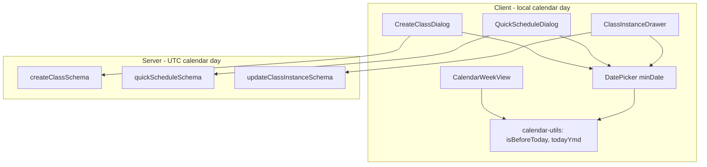

# Past-Date Scheduling Guard

Technical summary of the scheduling guard that prevents creating or rescheduling classes on previous calendar days, while keeping historical sessions viewable and editable.

**Status:** Implemented (June 2026)

---

## Product rules

| Action | Rule |
|--------|------|
| **CREATE** (New class, Quick schedule) | Start date must be **today or later** (local calendar day) |
| **VIEW** | Any date — week/month navigation unchanged |
| **EDIT existing instance** | Allowed — plan, status, attendance, template assign, etc. |
| **RESCHEDULE** | Target date must be **today or later** |
| **Quick schedule from class plans** | Same create rule as calendar |

### Intentionally allowed

- Opening past instances in `ClassInstanceDrawer` (click event blocks on past days).
- Mark complete / cancel / attendance on past sessions.
- Recurring **series** edits still regenerate **future** instances only (existing behavior in `edit-class-dialog.tsx` + `DELETE /api/classes/:id`).

### Intentionally blocked

- Clicking empty hour slots on past days in the week calendar.
- Picking a past start date in Create Class or Quick Schedule dialogs.
- Rescheduling an instance to a date before today.

### Same-day past time

Create/reschedule is gated on **calendar day**, not clock time. A class on **today** at 9:00 AM can still be created at 3:00 PM — only dates strictly before today are rejected.

---

## Architecture



**Defense in depth:** UI prevents most mistakes; Zod validation on the API rejects bypass attempts (direct API calls, stale form state).

**Timezone note:** Client uses the instructor's **local** calendar day. Server validation uses **UTC** calendar day (consistent with existing scheduling helpers like `toDateOnlyUTC`, `parseYmd`, and delete-class future-only logic). Edge cases near midnight across timezones are possible but acceptable for MVP.

---

## Files changed

| File | Change |
|------|--------|
| [`client/src/lib/calendar-utils.ts`](client/src/lib/calendar-utils.ts) | Added `isBeforeToday()`, `todayYmd()` |
| [`client/src/components/ui/date-picker.tsx`](client/src/components/ui/date-picker.tsx) | Added optional `minDate` prop → `Calendar` `disabled={{ before }}` |
| [`client/src/components/scheduling/calendar-week-view.tsx`](client/src/components/scheduling/calendar-week-view.tsx) | Disabled past-day empty hour slots |
| [`client/src/components/scheduling/create-class-dialog.tsx`](client/src/components/scheduling/create-class-dialog.tsx) | `minDate={todayYmd()}` on start date only |
| [`client/src/components/scheduling/quick-schedule-dialog.tsx`](client/src/components/scheduling/quick-schedule-dialog.tsx) | `minDate` on date field; past slot prefill falls back to today |
| [`client/src/components/scheduling/class-instance-drawer.tsx`](client/src/components/scheduling/class-instance-drawer.tsx) | Reschedule `minDate` + client guard before API call |
| [`server/src/modules/scheduling/scheduling.validation.ts`](server/src/modules/scheduling/scheduling.validation.ts) | Past-date checks on create, quick-schedule, instance reschedule |

**Not changed:** `edit-class-dialog.tsx` still has a local `todayYmd()` for recurring regeneration anchor — unrelated to this feature but could be consolidated later.

---

## Client implementation

### Shared helpers (`calendar-utils.ts`)

```typescript
/** True when `d` is strictly before today's local calendar day. */
export function isBeforeToday(d: Date): boolean {
  const day = startOfLocalDay(d);
  const today = startOfLocalDay(new Date());
  return day.getTime() < today.getTime();
}

/** Today's local calendar date as `YYYY-MM-DD`. */
export function todayYmd(): string {
  return formatYmdLocal(new Date());
}
```

Uses existing `startOfLocalDay` / `formatYmdLocal` so behavior matches the rest of the calendar UI.

### DatePicker (`minDate`)

New prop on [`DatePicker`](client/src/components/ui/date-picker.tsx):

- `minDate?: string` — `YYYY-MM-DD`
- Passed to react-day-picker as `disabled={{ before: ymdToDate(minDate) }}`
- Greys out and prevents selecting earlier dates in the popover calendar

Recurring **end date** in Create Class is **not** given `minDate` — only the series **start date** is restricted. End date must still be ≥ start date (existing Zod refine).

### Calendar week view

For each day column, `isPastDay = isBeforeToday(d)`.

Past-day **empty slots**:

- `disabled` on the hour `<button>`
- Muted styling (`opacity-40`, `cursor-default`)
- No `onClick` handler
- Accessible label: `Cannot schedule in the past (YYYY-MM-DD HH:00)`

Past-day **event blocks** (`CalendarEventBlock`) are unchanged — still open the drawer for view/edit.

### Create class dialog

Start date `DatePicker` receives `minDate={todayYmd()}`.

Submit still goes through existing `createClassFormSchema` (no past-date client Zod yet); server rejects if bypassed.

### Quick schedule dialog

1. **Date picker:** `minDate={todayYmd()}`
2. **Slot prefill** (from calendar click):

```typescript
const prefillDate = slotPrefill?.date ?? "";
const scheduleDate =
  prefillDate && prefillDate >= todayYmd() ? prefillDate : prefillDate ? todayYmd() : "";
```

If user navigates to a past week and somehow triggers the dialog, the date defaults to today instead of the past slot.

Quick schedule opened from **class plans** (template prefill, no slot) uses the same date picker rules.

### Class instance drawer — reschedule

1. **DatePicker:** `minDate={todayYmd()}`
2. **`saveReschedule` guard:**

```typescript
if (reschedule.date < todayYmd()) {
  toast.error("Cannot reschedule to a past date");
  return;
}
```

String comparison on `YYYY-MM-DD` is safe for chronological ordering.

**Status-only updates** (mark complete, cancel) do not send `date` — unaffected.

**Recurring “all future classes”** reschedule sends `rescheduleToDate` on `PATCH /api/classes/:id` — that path is not covered by `updateClassInstanceSchema`. Future hardening could add the same check to `updateClassSchema` when `rescheduleToDate` is present.

---

## Server implementation

Helpers in [`scheduling.validation.ts`](server/src/modules/scheduling/scheduling.validation.ts):

```typescript
function todayUtcCalendarDate(): Date { /* UTC midnight today */ }
function utcCalendarDateFromDate(d: Date): Date { /* strip to UTC Y-M-D */ }
function parseYmdUtc(ymd: string): Date { /* YYYY-MM-DD → UTC date */ }
function isBeforeTodayUtc(d: Date): boolean { /* ... */ }
function isYmdBeforeTodayUtc(ymd: string): boolean { /* ... */ }
```

### `createClassSchema`

After existing recurring/endDate refines:

- Rejects when `isBeforeTodayUtc(data.startDate)`
- Message: `"Start date cannot be in the past"`
- Path: `startDate`

`startDate` arrives as `z.coerce.date()` from ISO (client sends `localYmdToUtcIsoMidday`).

### `quickScheduleSchema`

- Rejects when `isYmdBeforeTodayUtc(data.date)`
- Message: `"Date cannot be in the past"`
- Path: `date`

### `updateClassInstanceSchema`

- Only when `data.date` is provided
- Rejects when `isYmdBeforeTodayUtc(data.date)`
- Message: `"Cannot reschedule to a past date"`
- Path: `date`

`PATCH` with only `status` or only `time` (no `date`) passes through.

Errors surface as **400** with Zod `details` via the global error handler.

---

## API endpoints affected

| Method | Route | Guard |
|--------|-------|-------|
| `POST` | `/api/classes` | `createClassSchema` → startDate |
| `POST` | `/api/quick-schedule` | `quickScheduleSchema` → date |
| `PATCH` | `/api/class-instances/:id` | `updateClassInstanceSchema` → date (when present) |

Unaffected: `GET` calendar instances, instance detail, plan edits, attendance, enrollments, series update without past target date in instance patch.

---

## User-facing behavior (QA checklist)

- [ ] Week view: past days show muted, non-clickable empty slots
- [ ] Week view: past events still open drawer
- [ ] Week view: today and future slots open Quick Schedule
- [ ] New class: cannot pick start date before today in calendar popover
- [ ] Quick schedule: same date restriction
- [ ] Quick schedule from past week navigation: date defaults to today if opened
- [ ] Instance drawer: reschedule picker cannot select past dates
- [ ] Instance drawer: save reschedule to past shows toast (if value somehow set)
- [ ] Mark complete / cancel / attendance on past instance still works
- [ ] API: `POST /api/quick-schedule` with yesterday's date returns 400

---

## Related existing behavior

These patterns predate the guard and remain aligned with it:

- **`DELETE /api/classes/:id`** — soft-deletes instances with `date >= today` only; past completed/cancelled rows preserved.
- **`EditClassDialog`** — recurring regeneration uses `regenerateFutureInstancesFrom = max(seriesStart, todayYmd())`; copy states past sessions are unchanged.
- **Phase 4 attendance** — past sessions remain editable so instructors can record who attended after class.

---

## Possible follow-ups (out of scope)

1. Consolidate `todayYmd()` — shared helper vs local copies in `edit-class-dialog.tsx` / `week-overview-panel.tsx`.
2. Add past-date refine to client Zod schemas (`create-class-form-schema`, `quick-schedule-form-schema`) for inline field errors before submit.
3. Guard `rescheduleToDate` on `updateClassSchema` for recurring series reschedule API path.
4. Toast when clicking a disabled past slot (optional UX polish).
5. Align server “today” with instructor timezone if multi-region becomes a requirement.

---

## Plan reference

Implementation follows [`.cursor/plans/past-date_scheduling_guard_5f85414c.plan.md`](.cursor/plans/past-date_scheduling_guard_5f85414c.plan.md).
