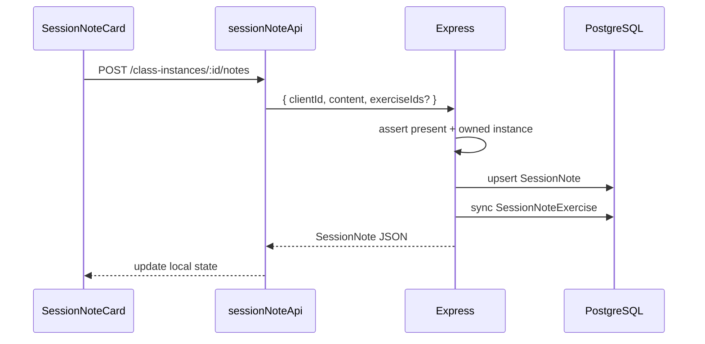
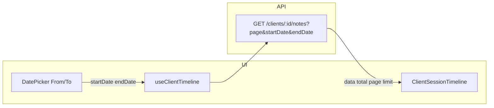

# Phase 5: Session Notes — Implementation Record

Technical documentation for **Phase 5 (Session Notes)** of the Pilates Platform MVP, including follow-up UI work on the client session history date filters and date-picker popover fixes.

**Plan reference:** `.cursor/plans/mvp_implementation_plan_4c3cd703.plan.md` (Phase 5)  
**Migration:** `server/prisma/migrations/20260603061323_add_session_notes/`

---

## Overview

Session notes let instructors record per-client observations for a specific **class instance**: free-text content plus optional links to exercises from the library. Notes are scoped to **one client per instance** (unique constraint). The feature appears in two places:

1. **Calendar class instance drawer** — write/edit notes for each client marked **present** on that session.
2. **Client profile** — paginated **session history** timeline with optional **class date range** filters.

All routes require authentication; data is scoped to `req.user.instructorId`.

---

## Product functionality

### Class instance drawer (scheduling)

- After attendance is saved, **Session notes** lists one card per **present** client.
- Each **Session note card** supports:
  - Textarea for note content (debounced save / create-on-first-edit).
  - **Attach exercises** via a picker dialog (library exercises with `savedToLibrary: true`).
  - Remove attached exercises; badges link to `/exercises/[id]`.
- Notes cannot be created until the client is marked **present** (server enforces; UI only shows present clients).
- **Upsert semantics:** `POST` on an instance creates a note or updates content if `(classInstanceId, clientId)` already exists.
- `AttendanceChecklist` exposes `onAttendanceSaved`; the drawer bumps `attendanceRefreshKey` so the notes section reloads roster + notes after attendance changes.

### Client profile (session history)

- **Session history** section on the client detail page (`ClientProfileView`).
- **Date range filter** (“From” / “To”) filters notes by the **scheduled class instance date** (`ClassInstance.date`), not note `createdAt`.
- Filter UX: library-style panel (Filters label, active count, clear filters, active badges with per-field remove).
- Paginated list (`SESSION_NOTE_TIMELINE_PAGE_SIZE` = 20) with `ExerciseLibraryPagination`.
- Each row shows class title, date/time, type/status badges, note text (expand/collapse for long content), exercise badges.
- Empty states distinguish **no notes ever** vs **no notes in filtered range**.

### Why session notes have an exercise picker

Exercises are **optional attachments** referencing the instructor’s library (e.g. movements practiced or prescribed). They are not required to save a text-only note. The picker reuses the library pattern but filters to saved library exercises suitable for quick tagging during or after class.

### Why session history has From / To date pickers

They narrow the timeline to sessions whose **class date** falls in the range—useful when reviewing progress over a month or before/after an injury. Omitting both dates shows all notes (paginated).

---

## Database (Prisma)

### Models

**`SessionNote`**

| Field | Type | Notes |
|-------|------|--------|
| `id` | `String` @id | cuid |
| `classInstanceId` | FK → `ClassInstance` | cascade delete |
| `clientId` | FK → `Client` | cascade delete |
| `content` | `String` | default `""` |
| `instructorId` | FK → `Instructor` | |
| `createdAt` / `updatedAt` | `DateTime` | |
| `deletedAt` | `DateTime?` | soft delete |

**Constraints:** `@@unique([classInstanceId, clientId])` — at most one active note per client per instance.

**`SessionNoteExercise`** — join table `(sessionNoteId, exerciseId)` with `@@unique([sessionNoteId, exerciseId])`.

### Relation updates

`Instructor`, `ClassInstance`, `Client`, and `Exercise` gained reverse relations to session notes / join rows (see `server/prisma/schema.prisma`).

### Migration command (PowerShell)

```powershell
cd "server" ; npx prisma migrate dev --name add_session_notes
npx prisma generate
```

---

## Backend API

### Module layout

`server/src/modules/session-notes/`

| File | Role |
|------|------|
| `session-note.validation.ts` | Zod schemas |
| `session-note.service.ts` | Business logic |
| `session-note.routes.ts` | Standalone note CRUD + exercise attach/detach |

Mounted in `server/src/app.ts`:

```ts
app.use("/api/session-notes", sessionNoteRoutes);
```

### Validation schemas (`session-note.validation.ts`)

- **`createSessionNoteSchema`** — `clientId`, optional `content` (trimmed), optional `exerciseIds[]`
- **`updateSessionNoteSchema`** — optional `content`
- **`attachExercisesSchema`** — `exerciseIds` min 1
- **`listClientNotesQuerySchema`** — `page`, `limit` (1–100, default 20), optional `startDate`, `endDate`

### Service highlights (`session-note.service.ts`)

| Function | Behavior |
|----------|----------|
| `createOrUpsertSessionNote` | Validates owned instance; client must be **present** (or enrolled check path); upsert by `(instance, client)`; optional exercise sync |
| `listSessionNotesForInstance` | All notes for instance, ordered by client name |
| `getClientSessionNotesTimeline` | Paginated timeline for client; filters on `classInstance.date`; includes instance + class summary |
| `getSessionNoteById` | Single note with client + exercises |
| `updateSessionNote` | Content update |
| `deleteSessionNote` | Soft delete (`deletedAt`) |
| `attachExercisesToNote` / `detachExerciseFromNote` | Join row add/remove; exercises must belong to instructor |

Helpers: `getOwnedInstance`, `assertClientPresentOnInstance`, `getOwnedNote`, `assertExercisesOwned`, `syncNoteExercises` (`createMany` + `skipDuplicates`).

### HTTP routes

**Class instance** (`server/src/modules/scheduling/class-instance.routes.ts`)

| Method | Path | Handler |
|--------|------|---------|
| `GET` | `/api/class-instances/:id/notes` | `listSessionNotesForInstance` |
| `POST` | `/api/class-instances/:id/notes` | `createOrUpsertSessionNote` (validated body) |

**Client** (`server/src/modules/clients/client.routes.ts`)

| Method | Path | Handler |
|--------|------|---------|
| `GET` | `/api/clients/:id/notes` | `getClientSessionNotesTimeline` (query: page, limit, startDate, endDate) |

**Session notes** (`/api/session-notes`)

| Method | Path | Handler |
|--------|------|---------|
| `GET` | `/:id` | `getSessionNoteById` |
| `PATCH` | `/:id` | `updateSessionNote` |
| `DELETE` | `/:id` | `deleteSessionNote` |
| `POST` | `/:id/exercises` | `attachExercisesToNote` |
| `DELETE` | `/:id/exercises/:exerciseId` | `detachExerciseFromNote` |

All use `authenticate` middleware.

---

## Frontend

### Types (`client/src/lib/types.ts`)

- `SessionNoteExerciseRow` — join row + `{ id, name }` exercise
- `SessionNote` — full note for drawer/editing
- `SessionNoteTimelineItem` — note + nested `classInstance` + `class`
- `SessionNoteTimelineResponse` — `{ data, total, page, limit }`

### API client (`client/src/services/session-note-api.ts`)

| Method | Endpoint |
|--------|----------|
| `getInstanceNotes(instanceId)` | `GET /class-instances/:id/notes` |
| `getClientNotes(clientId, params?)` | `GET /clients/:id/notes` |
| `createNote(instanceId, body)` | `POST /class-instances/:id/notes` |
| `getNoteById` / `updateNote` / `deleteNote` | `/session-notes/:id` |
| `attachExercises` / `detachExercise` | `/session-notes/:id/exercises` |

Constant: `SESSION_NOTE_TIMELINE_PAGE_SIZE = 20`.

### Hooks

| File | Purpose |
|------|---------|
| `client/src/hooks/clients/use-client-timeline.ts` | Loads paginated timeline; resets to page 1 when `startDate`/`endDate` change; abortable fetch |

### UI components (new)

| File | Purpose |
|------|---------|
| `session-notes-section.tsx` | Drawer section: load attendance + notes; render `SessionNoteCard` per present client |
| `session-note-card.tsx` | Per-client editor, save, exercise attach/detach |
| `session-note-exercise-picker-dialog.tsx` | Multi-select exercise picker (library, `savedToLibrary`) |
| `client-session-timeline.tsx` | Profile session history + date filters + pagination |
| `use-client-timeline.ts` | Data hook for timeline |

### UI integration (modified)

| File | Change |
|------|--------|
| `class-instance-drawer.tsx` | `SessionNotesSection` below `AttendanceChecklist`; `attendanceRefreshKey` + `onAttendanceSaved` |
| `attendance-checklist.tsx` | Optional `onAttendanceSaved` callback after successful save |
| `client-profile-view.tsx` | Renders `ClientSessionTimeline` |

---

## Date picker & popover fixes (session history UX)

Reported issues after initial Phase 5 UI:

1. Calendar opened to the **side** of inputs instead of above/below.
2. Opening the calendar **downward** caused a **double vertical scrollbar** on the page.

### Root causes (technical)

- Base UI `Popover` default collision uses `fallbackAxisSide: 'end'`, allowing flip to **left/right**.
- Popover `positionMethod` defaulted to **`absolute`** inside a portaled tree, interacting with the scrollable `<main>` (`overflow-y-auto`).
- Floating UI **size middleware** sets `--available-height` on the positioner; nested `overflow` / `max-height` on popover shells can create an inner scroll area.
- `[scrollbar-gutter: stable]` on `main` reserved a permanent gutter that looked like a second vertical bar when combined with the main scrollbar.

### Fixes applied

#### `client/src/components/ui/popover.tsx`

- Forward **`positionMethod`** to `PopoverPrimitive.Positioner`.
- Forward **`collisionBoundary`**, **`collisionPadding`**, **`collisionAvoidance`** (already partially present).
- `data-slot="popover-positioner"` on positioner for CSS targeting.
- Positioner classes: `max-h-none overflow-visible`.

#### `client/src/components/ui/date-picker.tsx`

- New props: **`popoverSide`** (`"top"` | `"bottom"`, default `"bottom"`), **`lockPopoverSide`** (sets collision `side: "none"` to prevent vertical flip).
- `PopoverContent`: `positionMethod="fixed"`, `collisionAvoidance` with `align: "shift"`, `fallbackAxisSide: "none"`, `collisionBoundary: document.documentElement`, `collisionPadding: 16`.
- Content classes: `block max-h-none w-auto overflow-visible`.

#### `client/src/components/ui/time-picker.tsx`

- Same popover positioning pattern for consistency (`fixed`, collision, boundary).

#### `client/src/components/clients/client-session-timeline.tsx`

- Filter panel styled as a proper filter block (icons, active count, clear, active badges).
- Date pickers: `popoverSide="top"` + **`lockPopoverSide`** so calendars open upward and do not flip downward in the scrollable profile page.
- Removed unnecessary `overflow-visible` / `z-10` wrappers after popover fix.

#### `client/src/components/layout/app-layout.tsx`

- Removed **`[scrollbar-gutter:stable]`** from `<main>` to eliminate double-gutter appearance.

#### `client/src/app/globals.css`

```css
[data-slot="popover-positioner"]:has([data-slot="popover-content"] .rdp-root),
[data-slot="popover-content"]:has(.rdp-root) {
  max-height: none !important;
  overflow: visible !important;
}
```

Prevents react-day-picker calendars from living inside a clipped scrollable popover shell.

### Build fix (timeline pagination)

`ExerciseLibraryPagination` does not accept `className`; wrapper `div` used for layout spacing where needed.

---

## Complete file change list

### New files

**Server**

- `server/src/modules/session-notes/session-note.validation.ts`
- `server/src/modules/session-notes/session-note.service.ts`
- `server/src/modules/session-notes/session-note.routes.ts`
- `server/prisma/migrations/20260603061323_add_session_notes/migration.sql`

**Client**

- `client/src/services/session-note-api.ts`
- `client/src/hooks/clients/use-client-timeline.ts`
- `client/src/components/scheduling/session-notes-section.tsx`
- `client/src/components/scheduling/session-note-card.tsx`
- `client/src/components/scheduling/session-note-exercise-picker-dialog.tsx`
- `client/src/components/clients/client-session-timeline.tsx`

**Documentation**

- `PHASE5_SESSION_NOTES_IMPLEMENTATION.md` (this file)

### Modified files

**Server**

- `server/prisma/schema.prisma` — `SessionNote`, `SessionNoteExercise`, relations
- `server/src/app.ts` — mount `/api/session-notes`
- `server/src/modules/scheduling/class-instance.routes.ts` — `GET/POST :id/notes`
- `server/src/modules/clients/client.routes.ts` — `GET :id/notes`

**Client**

- `client/src/lib/types.ts` — session note types
- `client/src/components/scheduling/class-instance-drawer.tsx` — session notes integration
- `client/src/components/scheduling/attendance-checklist.tsx` — `onAttendanceSaved`
- `client/src/components/clients/client-profile-view.tsx` — timeline section
- `client/src/components/ui/popover.tsx` — positioning props + positioner slot
- `client/src/components/ui/date-picker.tsx` — popover positioning props
- `client/src/components/ui/time-picker.tsx` — popover positioning alignment
- `client/src/components/layout/app-layout.tsx` — scrollbar-gutter removed from main
- `client/src/app/globals.css` — date picker popover overflow rules

### Not modified

- `.cursor/plans/mvp_implementation_plan_4c3cd703.plan.md` (per instruction during implementation)

---

## Data flow diagrams

### Create/update note from calendar



### Client timeline with date filter



---

## Testing checklist

### Drawer

- [ ] Open a class instance with enrolled clients; mark at least one **present** and save attendance.
- [ ] Session note card appears for present clients only.
- [ ] Save text; refresh drawer — content persists.
- [ ] Attach exercises; links open exercise detail; detach removes badge.
- [ ] Second client present → separate cards; unique note per client per instance.

### Client profile

- [ ] Session history lists notes newest/oldest per API order.
- [ ] Set **From** / **To** — list filters by class date; clear filters restores full set.
- [ ] Pagination works when total > 20.
- [ ] Long note “Show more / less” toggles.
- [ ] Date pickers open **above** inputs; **single** page scrollbar (no double bar).

### API / auth

- [ ] Unauthenticated requests rejected.
- [ ] Cannot access another instructor’s notes/instances.

---

## Related conventions (project rules)

- Soft deletes: `deletedAt` on `SessionNote`.
- Zod validation via `validate()` middleware; client uses shared patterns in `@/services/*` and `api` with credentials.
- UI: `rounded-3xl` cards, `font-heading`, filter patterns aligned with exercise/class-plan libraries.
- Pagination component: `ExerciseLibraryPagination` with controlled `page` / `totalPages` / `onPageChange`.

---

## Implementation phases (todo mapping)

| ID | Task | Status |
|----|------|--------|
| 5.1-schema | Prisma models + migration | Done |
| 5.2-validation | Zod schemas | Done |
| 5.2-service | Service layer | Done |
| 5.2-routes | Routes + mounts | Done |
| 5.3-types-api | Client types + `session-note-api` | Done |
| 5.3-drawer-ui | Drawer session notes UI | Done |
| 5.4-timeline-ui | Client timeline + date filter | Done |

---

*Generated from Phase 5 implementation and follow-up UI sessions (session notes, session history filters, date-picker popover fixes).*
